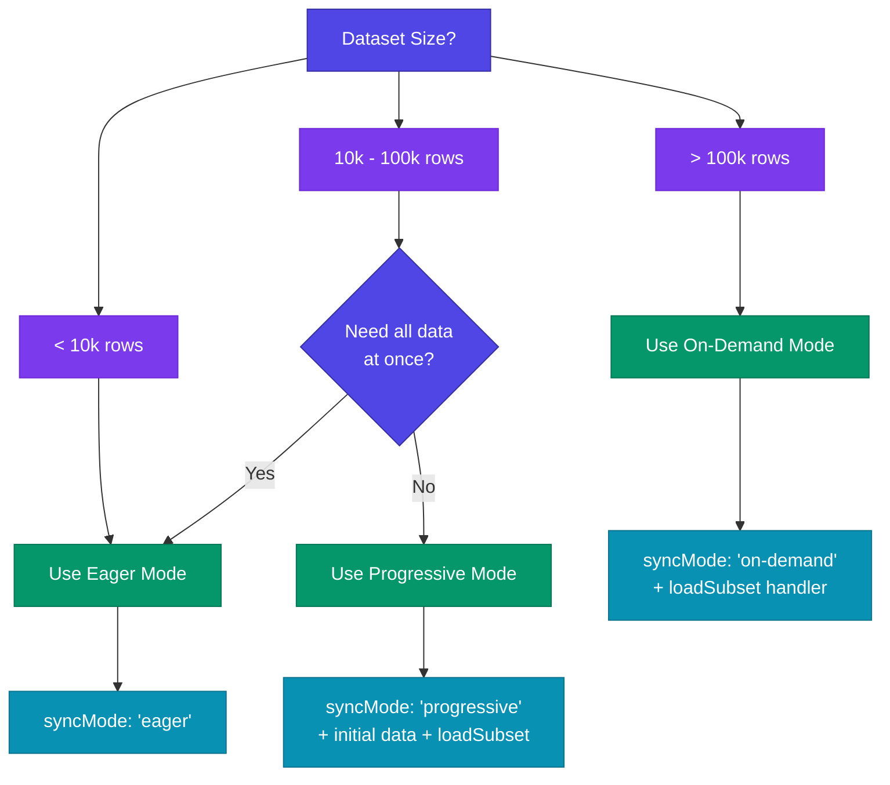
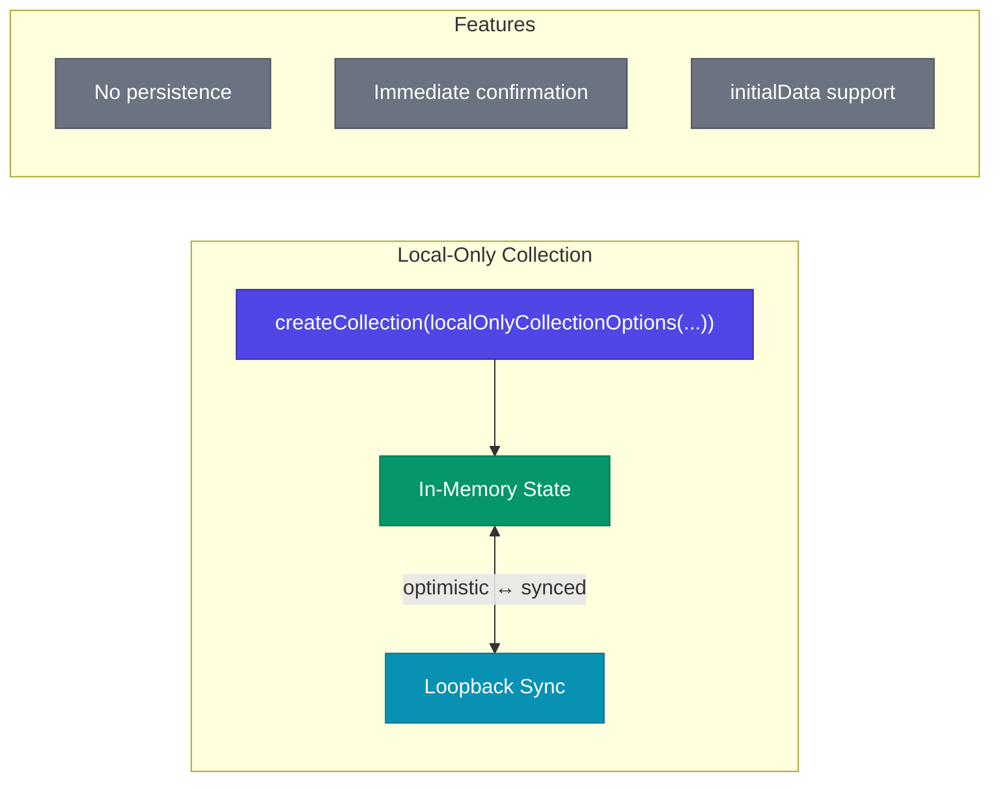
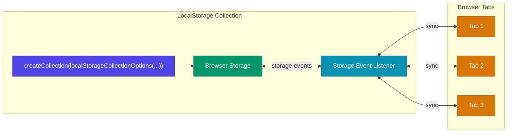
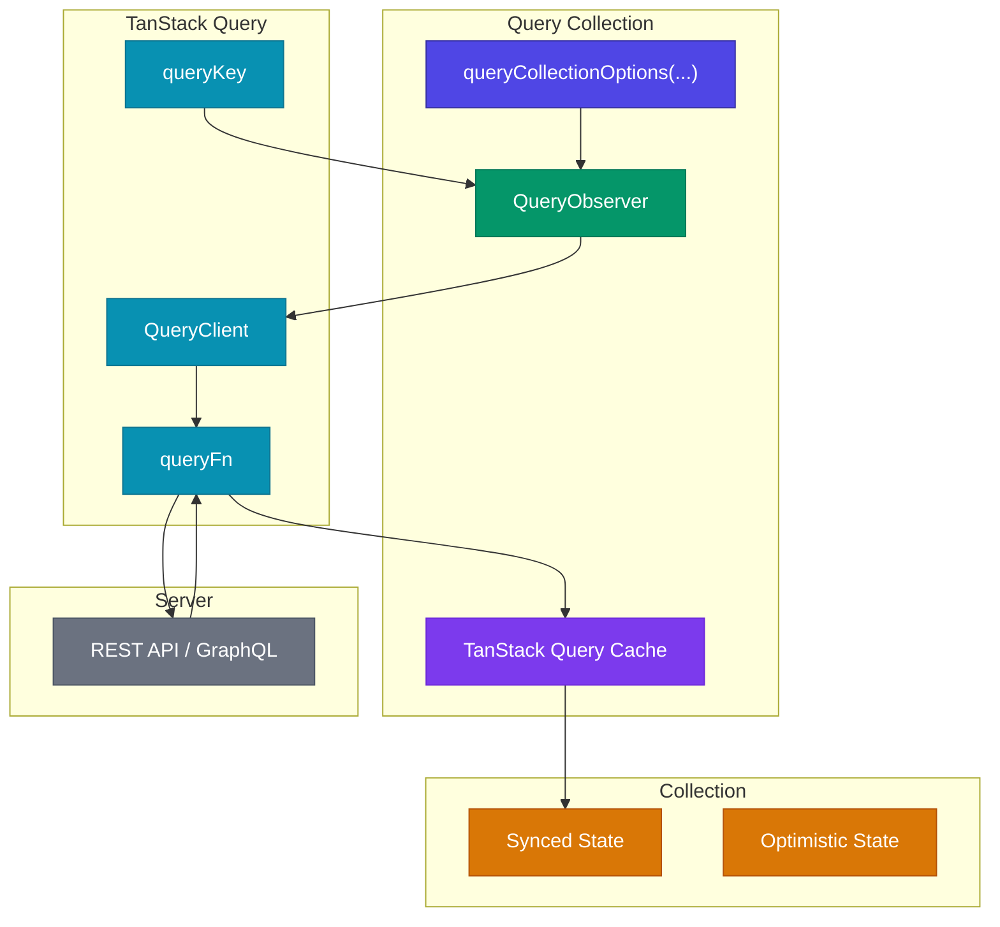
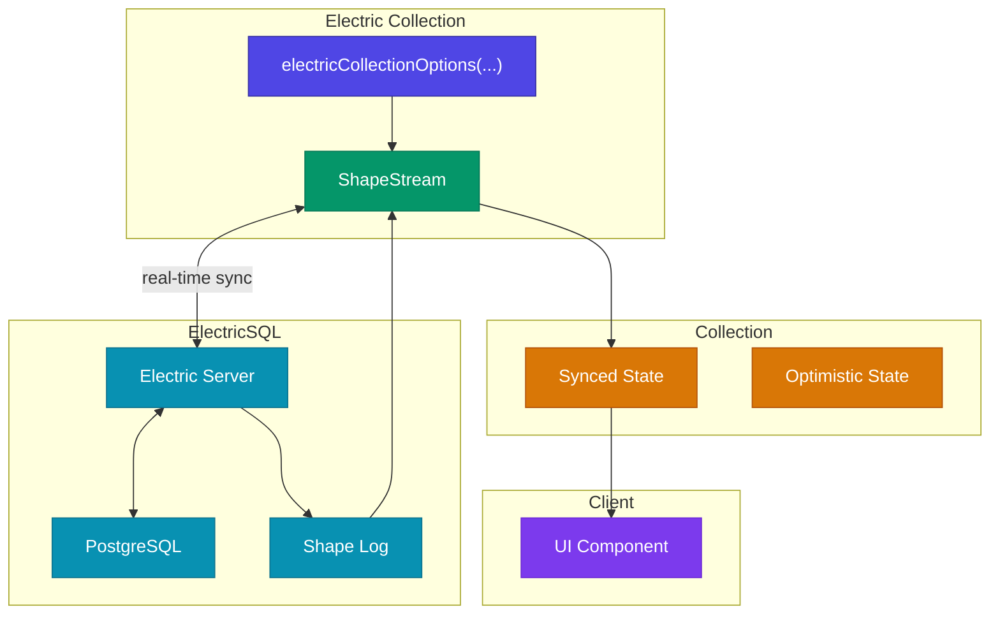
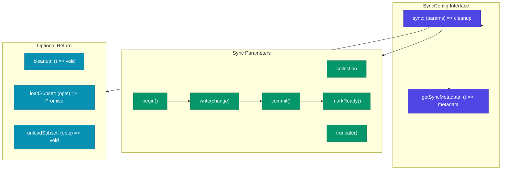
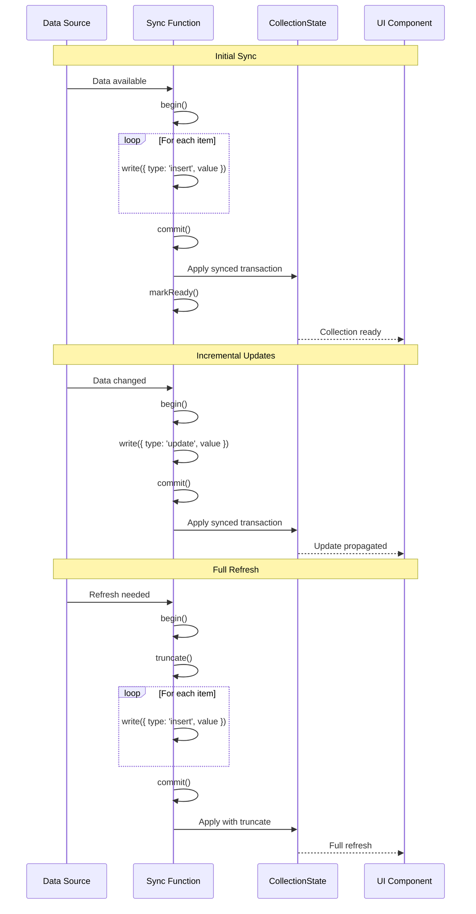
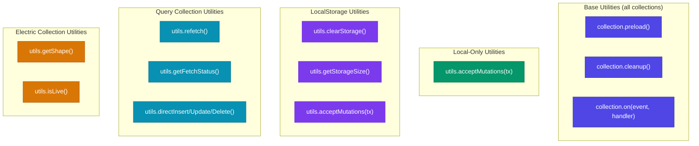

# TanStack DB Collections Architecture

This document details the collection types and sync patterns in TanStack DB, covering the various collection implementations and how they integrate with different data sources.

## Collection Type Hierarchy

```mermaid
flowchart TD
    subgraph CoreAPI["Core Collection API"]
        createCollection["createCollection()"]:::core
        CollectionConfig["CollectionConfig"]:::config
    end

    subgraph BuiltIn["Built-in Collection Types"]
        LocalOnly["localOnlyCollectionOptions"]:::builtin
        LocalStorage["localStorageCollectionOptions"]:::builtin
    end

    subgraph Providers["Collection Providers"]
        QueryColl["queryCollectionOptions"]:::provider
        ElectricColl["electricCollectionOptions"]:::provider
        PowerSyncColl["powerSyncCollectionOptions"]:::provider
        RxDBColl["rxdbCollectionOptions"]:::provider
        TrailBaseColl["trailbaseCollectionOptions"]:::provider
    end

    subgraph Custom["Custom Implementation"]
        CustomSync["Custom sync config"]:::custom
    end

    CollectionConfig --> createCollection
    
    LocalOnly --> CollectionConfig
    LocalStorage --> CollectionConfig
    
    QueryColl --> CollectionConfig
    ElectricColl --> CollectionConfig
    PowerSyncColl --> CollectionConfig
    RxDBColl --> CollectionConfig
    TrailBaseColl --> CollectionConfig
    
    CustomSync --> CollectionConfig

    %% Click events
    click createCollection "https://github.com/TanStack/db/blob/main/packages/db/src/collection/index.ts"
    click LocalOnly "https://github.com/TanStack/db/blob/main/packages/db/src/local-only.ts"
    click LocalStorage "https://github.com/TanStack/db/blob/main/packages/db/src/local-storage.ts"
    click QueryColl "https://github.com/TanStack/db/blob/main/packages/query-db-collection/src/query.ts"
    click ElectricColl "https://github.com/TanStack/db/blob/main/packages/electric-db-collection/src/index.ts"
    click PowerSyncColl "https://github.com/TanStack/db/blob/main/packages/powersync-db-collection/src/index.ts"
    click RxDBColl "https://github.com/TanStack/db/blob/main/packages/rxdb-db-collection/src/index.ts"

    %% Styles
    classDef core fill:#4f46e5,stroke:#3730a3,color:#fff
    classDef config fill:#7c3aed,stroke:#6d28d9,color:#fff
    classDef builtin fill:#059669,stroke:#047857,color:#fff
    classDef provider fill:#0891b2,stroke:#0e7490,color:#fff
    classDef custom fill:#d97706,stroke:#b45309,color:#fff
```



## Collection Types Reference

| Type | Package | Persistence | Sync Mode | Use Case |
|------|---------|-------------|-----------|----------|
| Local-Only | `@tanstack/db` | In-memory | Loopback | Temporary data, form state |
| LocalStorage | `@tanstack/db` | Browser storage | Cross-tab sync | Settings, preferences |
| Query | `@tanstack/query-db-collection` | None | Fetch-based | REST APIs, GraphQL |
| Electric | `@tanstack/electric-db-collection` | SQLite | Real-time sync | Offline-first apps |
| PowerSync | `@tanstack/powersync-db-collection` | SQLite | Bidirectional | Mobile apps |
| RxDB | `@tanstack/rxdb-db-collection` | Various | RxJS streams | Reactive data stores |
| TrailBase | `@tanstack/trailbase-db-collection` | TrailBase | REST + subscriptions | TrailBase backends |

## Sync Modes

TanStack DB supports three sync modes that determine when data is loaded:

```mermaid
flowchart TD
    subgraph SyncModes["Sync Modes"]
        Eager["Eager Mode"]:::eager
        OnDemand["On-Demand Mode"]:::ondemand
        Progressive["Progressive Mode"]:::progressive
    end

    subgraph EagerDesc["Eager Mode"]
        E1["All data loaded upfront"]:::desc
        E2["collection.preload()"]:::desc
        E3["Best for small datasets"]:::desc
    end

    subgraph OnDemandDesc["On-Demand Mode"]
        O1["Data loaded per query"]:::desc
        O2["loadSubset() handler required"]:::desc
        O3["Best for large datasets"]:::desc
    end

    subgraph ProgressiveDesc["Progressive Mode"]
        P1["Start with partial data"]:::desc
        P2["Load more on demand"]:::desc
        P3["Combines eager + on-demand"]:::desc
    end

    Eager --> E1
    Eager --> E2
    Eager --> E3

    OnDemand --> O1
    OnDemand --> O2
    OnDemand --> O3

    Progressive --> P1
    Progressive --> P2
    Progressive --> P3

    %% Styles
    classDef eager fill:#059669,stroke:#047857,color:#fff
    classDef ondemand fill:#0891b2,stroke:#0e7490,color:#fff
    classDef progressive fill:#d97706,stroke:#b45309,color:#fff
    classDef desc fill:#6b7280,stroke:#4b5563,color:#fff
```



### Sync Mode Decision Tree



## Built-in Collection Types

### Local-Only Collection



### LocalStorage Collection



## Provider Collection Types

### Query Collection (TanStack Query)



### Electric Collection (Real-time Sync)



## Sync Configuration

Every collection requires a `sync` configuration that defines how data flows in and out:



### Sync Protocol Sequence



## Collection Utilities

Each collection type provides specific utility functions:



## Effect-TS Porting Guide

### Collection Types → Effect Layer

```typescript
// Effect-TS collection layer pattern
interface Collection<T, TKey> extends Effect.Tag<Collection<T, TKey>, {
  readonly get: (key: TKey) => Effect.Effect<Option<T>>
  readonly insert: (data: T) => Effect.Effect<void, ValidationError>
  readonly subscribeChanges: Stream.Stream<Array<Change<T>>>
}> {}

const CollectionLive = <T, TKey>(config: CollectionConfig<T, TKey>) =>
  Layer.effect(
    Collection<T, TKey>,
    Effect.gen(function* () {
      const stateRef = yield* Ref.make(initialState)
      // ... implementation
    })
  )
```

### LocalOnly → Effect Ref

```typescript
// Effect-TS local-only collection
const LocalOnlyLive = <T, TKey>(config: LocalOnlyConfig<T, TKey>) =>
  Layer.effect(
    Collection<T, TKey>,
    Effect.gen(function* () {
      const dataRef = yield* Ref.make<HashMap<TKey, T>>(
        HashMap.fromIterable(config.initialData ?? [])
      )
      
      const insert = (data: T) => Effect.gen(function* () {
        const key = config.getKey(data)
        yield* Ref.update(dataRef, HashMap.set(key, data))
      })
      
      return { insert, /* ... */ }
    })
  )
```

### LocalStorage → Effect KeyValueStore

```typescript
// Effect-TS localStorage collection
import { KeyValueStore } from "@effect/platform"

const LocalStorageLive = <T, TKey>(config: LocalStorageConfig<T, TKey>) =>
  Layer.effect(
    Collection<T, TKey>,
    Effect.gen(function* () {
      const store = yield* KeyValueStore.KeyValueStore
      const dataRef = yield* Ref.make<HashMap<TKey, T>>(HashMap.empty())
      
      // Initial load from storage
      const stored = yield* store.get(config.storageKey)
      if (Option.isSome(stored)) {
        const parsed = yield* Effect.try(() => JSON.parse(stored.value))
        yield* Ref.set(dataRef, HashMap.fromIterable(parsed))
      }
      
      return { /* ... */ }
    })
  ).pipe(Layer.provide(KeyValueStore.layerLocalStorage))
```

### Query Collection → Effect.cached + retry

```typescript
// Effect-TS query collection
const QueryCollectionLive = <T, TKey>(config: QueryConfig<T, TKey>) =>
  Layer.effect(
    Collection<T, TKey>,
    Effect.gen(function* () {
      const fetchData = yield* Effect.cached(
        config.queryFn.pipe(
          Effect.retry(Schedule.exponential("100 millis")),
          Effect.timeout("30 seconds")
        )
      )
      
      const refetch = Effect.gen(function* () {
        yield* Effect.sync(() => { /* invalidate cache */ })
        return yield* fetchData
      })
      
      return { refetch, /* ... */ }
    })
  )
```

### Electric Collection → Stream + Hub

```typescript
// Effect-TS electric collection with real-time sync
const ElectricCollectionLive = <T, TKey>(config: ElectricConfig<T, TKey>) =>
  Layer.effect(
    Collection<T, TKey>,
    Effect.gen(function* () {
      const changesHub = yield* Hub.unbounded<Array<Change<T>>>()
      const dataRef = yield* Ref.make<HashMap<TKey, T>>(HashMap.empty())
      
      // Subscribe to Electric shape stream
      const syncFiber = yield* Stream.fromAsyncIterable(
        config.shapeStream,
        e => new Error(String(e))
      ).pipe(
        Stream.tap(changes => Effect.gen(function* () {
          yield* applyChanges(dataRef, changes)
          yield* Hub.publish(changesHub, changes)
        })),
        Stream.runDrain,
        Effect.fork
      )
      
      return {
        subscribeChanges: Stream.fromHub(changesHub),
        cleanup: Fiber.interrupt(syncFiber),
        /* ... */
      }
    })
  )
```

## File Structure

```
packages/
├── db/src/
│   ├── local-only.ts           # Local-only collection options
│   └── local-storage.ts        # LocalStorage collection options
│
├── query-db-collection/src/
│   ├── query.ts                # TanStack Query integration
│   └── manual-sync.ts          # Direct write utilities
│
├── electric-db-collection/src/
│   └── index.ts                # ElectricSQL integration
│
├── powersync-db-collection/src/
│   └── index.ts                # PowerSync integration
│
├── rxdb-db-collection/src/
│   └── index.ts                # RxDB integration
│
└── trailbase-db-collection/src/
    └── index.ts                # TrailBase integration
```

## Related Documentation

- [ARCHITECTURE-OVERVIEW.md](./ARCHITECTURE-OVERVIEW.md) - High-level overview
- [ARCHITECTURE-CORE.md](./ARCHITECTURE-CORE.md) - Core collection internals
- [ARCHITECTURE-MUTATIONS.md](./ARCHITECTURE-MUTATIONS.md) - Mutation handling

