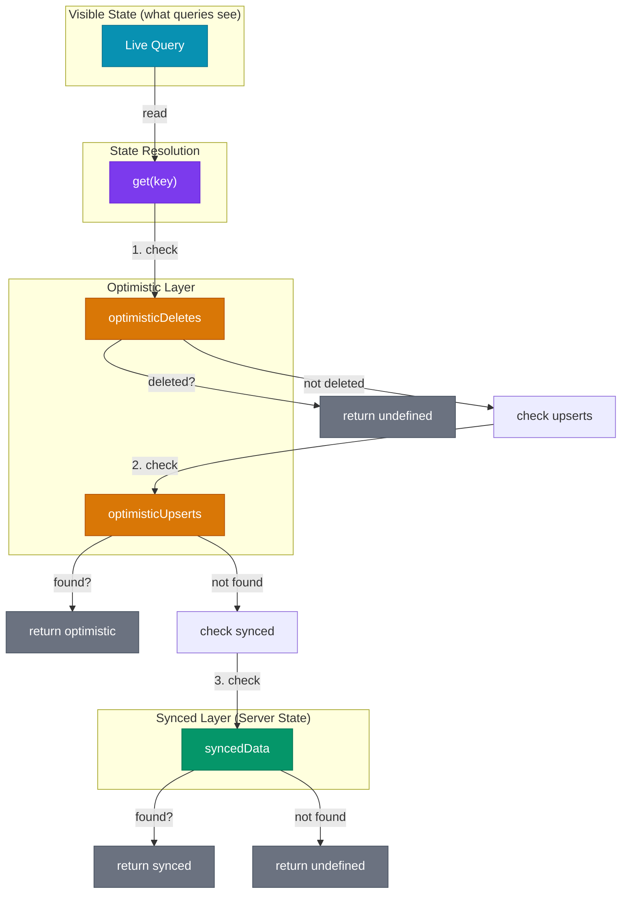
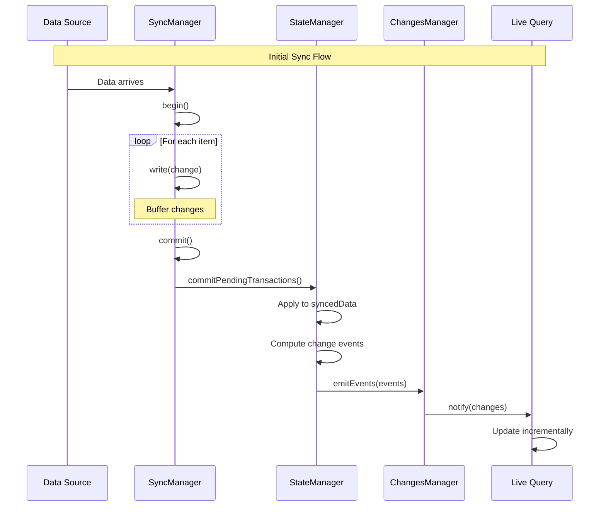
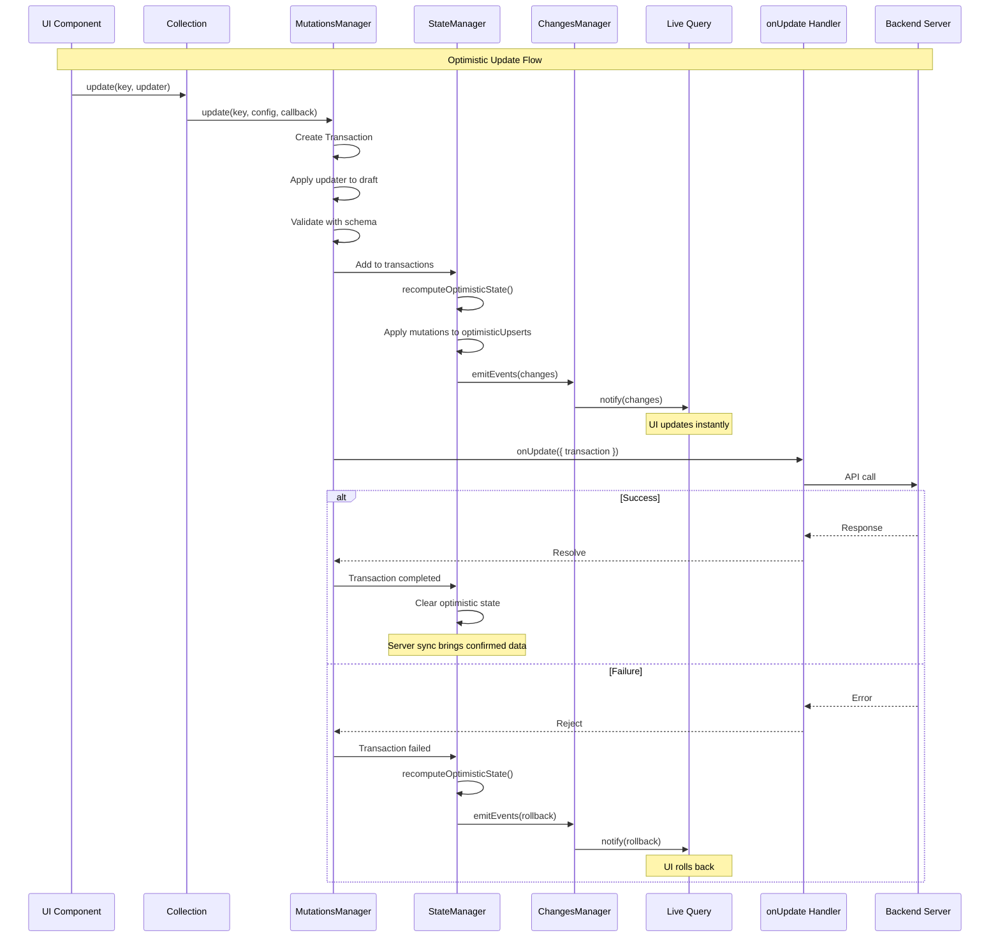
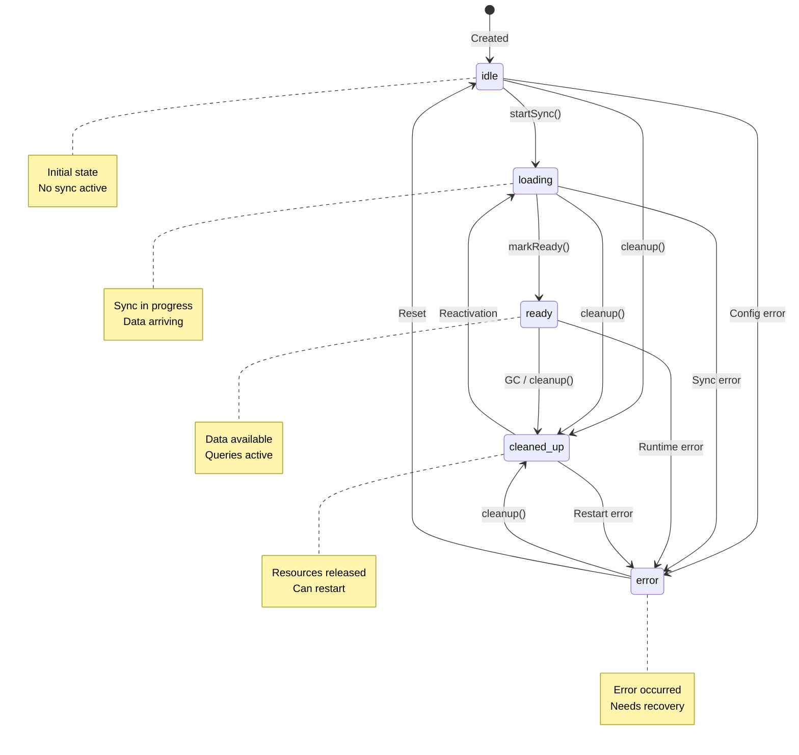
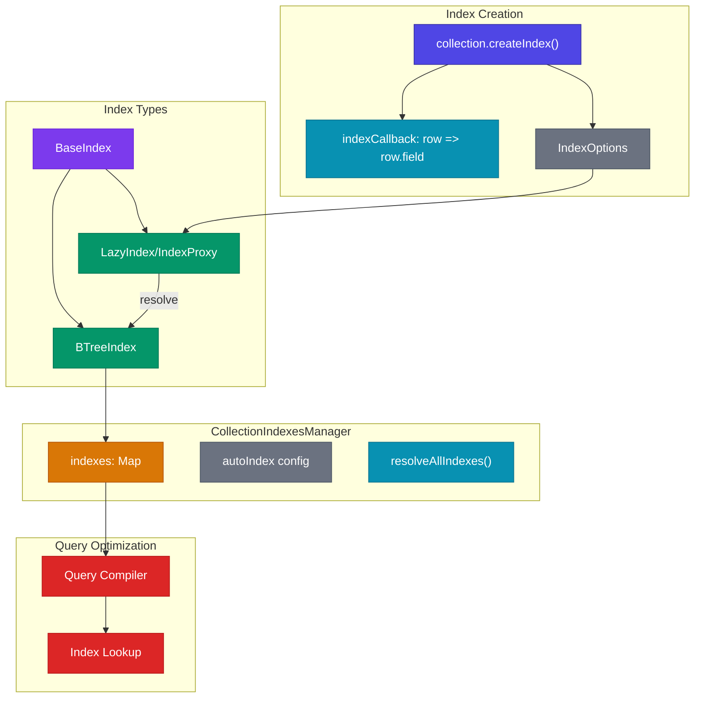
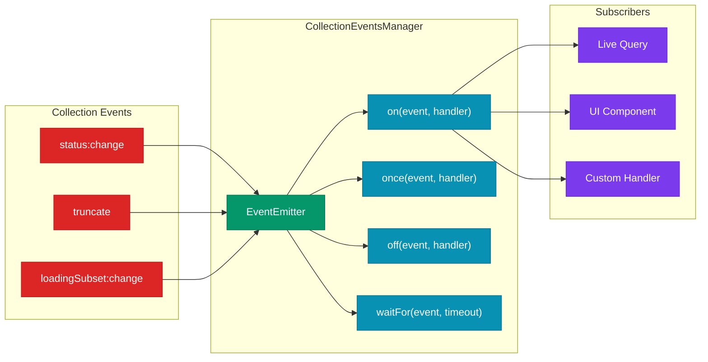

# TanStack DB Core Architecture

This document details the internal architecture of `@tanstack/db`, the core library that provides collections, state management, and the foundation for live queries.

## Collection Class Architecture

The `Collection` class is the central abstraction in TanStack DB. It delegates responsibilities to specialized manager classes that handle different aspects of collection behavior.

```mermaid
flowchart TD
    subgraph CollectionClass["CollectionImpl"]
        Collection["Collection"]:::main
    end

    subgraph Managers["Internal Managers"]
        StateManager["CollectionStateManager"]:::manager
        ChangesManager["CollectionChangesManager"]:::manager
        SyncManager["CollectionSyncManager"]:::manager
        LifecycleManager["CollectionLifecycleManager"]:::manager
        MutationsManager["CollectionMutationsManager"]:::manager
        IndexesManager["CollectionIndexesManager"]:::manager
        EventsManager["CollectionEventsManager"]:::manager
    end

    subgraph StateStorage["State Storage"]
        SyncedData["syncedData: SortedMap"]:::storage
        OptUpserts["optimisticUpserts: Map"]:::storage
        OptDeletes["optimisticDeletes: Set"]:::storage
        Transactions["transactions: SortedMap"]:::storage
    end

    Collection --> StateManager
    Collection --> ChangesManager
    Collection --> SyncManager
    Collection --> LifecycleManager
    Collection --> MutationsManager
    Collection --> IndexesManager
    Collection --> EventsManager

    StateManager --> SyncedData
    StateManager --> OptUpserts
    StateManager --> OptDeletes
    StateManager --> Transactions

    %% Click events
    click Collection "https://github.com/TanStack/db/blob/main/packages/db/src/collection/index.ts"
    click StateManager "https://github.com/TanStack/db/blob/main/packages/db/src/collection/state.ts"
    click ChangesManager "https://github.com/TanStack/db/blob/main/packages/db/src/collection/changes.ts"
    click SyncManager "https://github.com/TanStack/db/blob/main/packages/db/src/collection/sync.ts"
    click LifecycleManager "https://github.com/TanStack/db/blob/main/packages/db/src/collection/lifecycle.ts"
    click MutationsManager "https://github.com/TanStack/db/blob/main/packages/db/src/collection/mutations.ts"
    click IndexesManager "https://github.com/TanStack/db/blob/main/packages/db/src/collection/indexes.ts"
    click EventsManager "https://github.com/TanStack/db/blob/main/packages/db/src/collection/events.ts"

    %% Styles
    classDef main fill:#4f46e5,stroke:#3730a3,color:#fff
    classDef manager fill:#059669,stroke:#047857,color:#fff
    classDef storage fill:#7c3aed,stroke:#6d28d9,color:#fff
```



## Manager Responsibilities

| Manager | File | Responsibility | Effect-TS Equivalent |
|---------|------|----------------|---------------------|
| `CollectionStateManager` | `state.ts` | Manages synced data and optimistic state layers | `Ref` + `SynchronizedRef` |
| `CollectionChangesManager` | `changes.ts` | Handles subscriptions and change event emission | `SubscriptionRef` + `Stream` |
| `CollectionSyncManager` | `sync.ts` | Manages external data synchronization | `Effect.acquireRelease` + `Stream` |
| `CollectionLifecycleManager` | `lifecycle.ts` | Tracks collection status (idle/loading/ready/error) | State machine with `Effect.Tag` |
| `CollectionMutationsManager` | `mutations.ts` | Handles CRUD operations and validation | `Effect.gen` pipelines |
| `CollectionIndexesManager` | `indexes.ts` | Manages query indexes for performance | `HashMap` + lazy `Layer` |
| `CollectionEventsManager` | `events.ts` | EventEmitter for collection events | `PubSub` |

## State Management: Two-Layer Architecture

TanStack DB uses a two-layer state architecture that enables instant optimistic updates while maintaining server state consistency.



### State Resolution Algorithm

```typescript
// Simplified get() implementation
get(key: TKey): TOutput | undefined {
  // 1. Check if optimistically deleted
  if (this.optimisticDeletes.has(key)) {
    return undefined
  }
  
  // 2. Check optimistic upserts (inserts/updates)
  if (this.optimisticUpserts.has(key)) {
    return this.optimisticUpserts.get(key)
  }
  
  // 3. Fall back to synced data
  return this.syncedData.get(key)
}
```

## Sync Data Flow Sequence



## Optimistic Mutation Flow Sequence



## Collection Lifecycle State Machine



## Index System Architecture



## Event System



## File Structure

```
packages/db/src/
├── collection/
│   ├── index.ts          # CollectionImpl class + createCollection
│   ├── state.ts          # CollectionStateManager - state layers
│   ├── changes.ts        # CollectionChangesManager - subscriptions
│   ├── sync.ts           # CollectionSyncManager - data sync
│   ├── lifecycle.ts      # CollectionLifecycleManager - status
│   ├── mutations.ts      # CollectionMutationsManager - CRUD
│   ├── indexes.ts        # CollectionIndexesManager - indexes
│   ├── events.ts         # CollectionEventsManager - events
│   ├── change-events.ts  # Change event utilities
│   └── subscription.ts   # CollectionSubscription type
│
├── indexes/
│   ├── base-index.ts     # BaseIndex abstract class
│   ├── btree-index.ts    # BTreeIndex implementation
│   ├── lazy-index.ts     # LazyIndex/IndexProxy
│   ├── auto-index.ts     # Auto-indexing logic
│   ├── index-options.ts  # Index configuration types
│   └── reverse-index.ts  # Reverse index utilities
│
├── SortedMap.ts          # Deterministic-order Map
├── transactions.ts       # Transaction class
├── proxy.ts              # Draft proxy for mutations
├── scheduler.ts          # Task scheduling
├── event-emitter.ts      # Base EventEmitter
├── deferred.ts           # Deferred promise utility
├── errors.ts             # Error classes
├── types.ts              # Core type definitions
└── utils.ts              # Utility functions
```

## Effect-TS Porting Guide

### CollectionImpl → Effect.Service + Layer

```typescript
// Effect-TS equivalent structure
interface Collection<T, TKey> {
  readonly get: (key: TKey) => Effect.Effect<Option<T>>
  readonly has: (key: TKey) => Effect.Effect<boolean>
  readonly insert: (data: T) => Effect.Effect<Transaction, ValidationError>
  readonly update: (key: TKey, updater: (draft: T) => void) => Effect.Effect<Transaction>
  readonly delete: (key: TKey) => Effect.Effect<Transaction>
  readonly subscribeChanges: (callback: (changes: Array<Change<T>>) => void) => Effect.Effect<Subscription>
}

const CollectionTag = Context.GenericTag<Collection<unknown, unknown>>("Collection")

const CollectionLive = Layer.effect(
  CollectionTag,
  Effect.gen(function* () {
    const stateRef = yield* Ref.make(initialState)
    const changesHub = yield* Hub.unbounded<Array<Change>>()
    // ... implementation
  })
)
```

### StateManager → Ref + SynchronizedRef

```typescript
// Effect-TS state management
const StateManagerLive = Layer.effect(
  StateManagerTag,
  Effect.gen(function* () {
    const syncedData = yield* Ref.make(HashMap.empty<TKey, T>())
    const optimisticUpserts = yield* Ref.make(HashMap.empty<TKey, T>())
    const optimisticDeletes = yield* Ref.make(HashSet.empty<TKey>())
    
    const get = (key: TKey) => Effect.gen(function* () {
      const deletes = yield* Ref.get(optimisticDeletes)
      if (HashSet.has(deletes, key)) return Option.none()
      
      const upserts = yield* Ref.get(optimisticUpserts)
      const upserted = HashMap.get(upserts, key)
      if (Option.isSome(upserted)) return upserted
      
      const synced = yield* Ref.get(syncedData)
      return HashMap.get(synced, key)
    })
    
    return { get, /* ... */ }
  })
)
```

### ChangesManager → SubscriptionRef + Stream

```typescript
// Effect-TS change subscription
const ChangesManagerLive = Layer.effect(
  ChangesManagerTag,
  Effect.gen(function* () {
    const changesHub = yield* Hub.unbounded<Array<Change<T>>>()
    
    const subscribe = Effect.gen(function* () {
      return yield* Hub.subscribe(changesHub)
    })
    
    const emit = (changes: Array<Change<T>>) => 
      Hub.publish(changesHub, changes)
    
    return { subscribe, emit }
  })
)
```

### LifecycleManager → State Machine

```typescript
// Effect-TS lifecycle state machine
type CollectionStatus = "idle" | "loading" | "ready" | "error" | "cleaned-up"

const LifecycleManagerLive = Layer.effect(
  LifecycleManagerTag,
  Effect.gen(function* () {
    const statusRef = yield* Ref.make<CollectionStatus>("idle")
    
    const transition = (to: CollectionStatus) => Effect.gen(function* () {
      const from = yield* Ref.get(statusRef)
      if (!isValidTransition(from, to)) {
        return yield* Effect.fail(new InvalidTransitionError(from, to))
      }
      yield* Ref.set(statusRef, to)
    })
    
    return { status: Ref.get(statusRef), transition }
  })
)
```

## Related Documentation

- [ARCHITECTURE-OVERVIEW.md](./ARCHITECTURE-OVERVIEW.md) - High-level overview
- [ARCHITECTURE-IVM.md](./ARCHITECTURE-IVM.md) - Incremental View Maintenance
- [ARCHITECTURE-QUERY.md](./ARCHITECTURE-QUERY.md) - Query system
- [ARCHITECTURE-MUTATIONS.md](./ARCHITECTURE-MUTATIONS.md) - Mutation lifecycle

