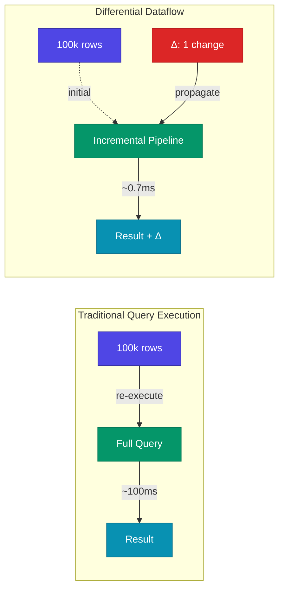
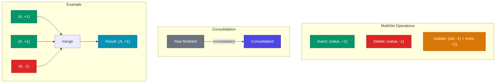
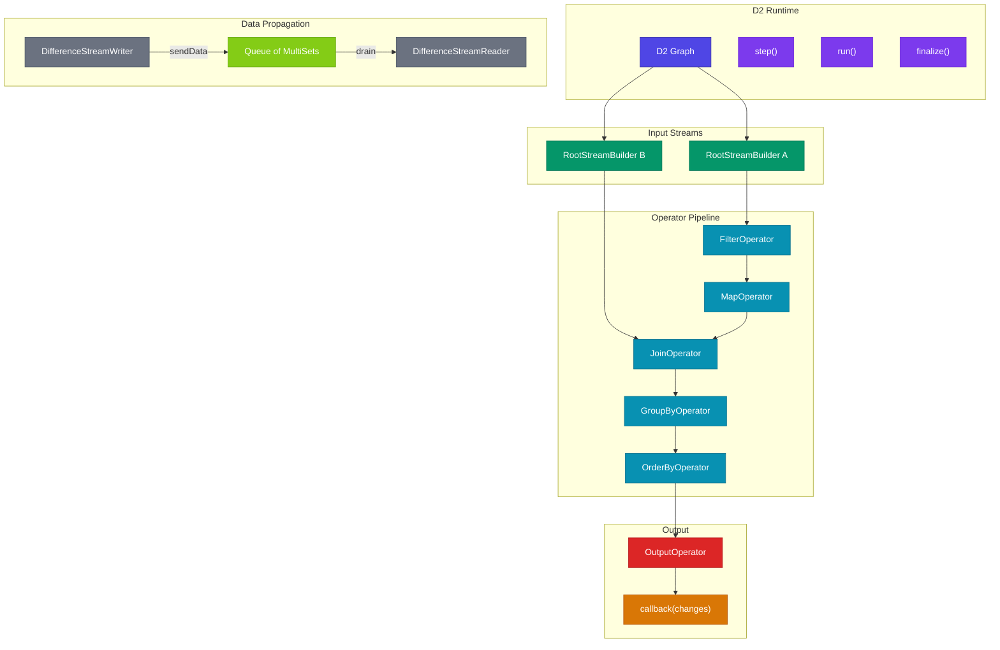
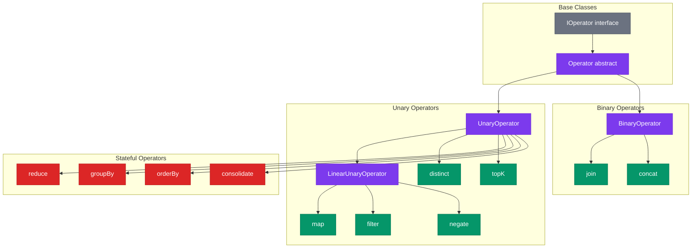
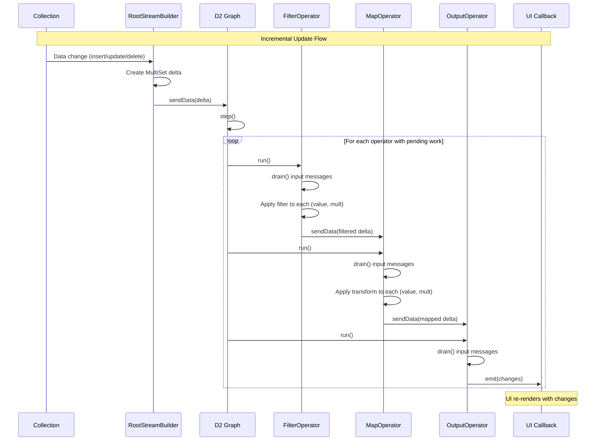
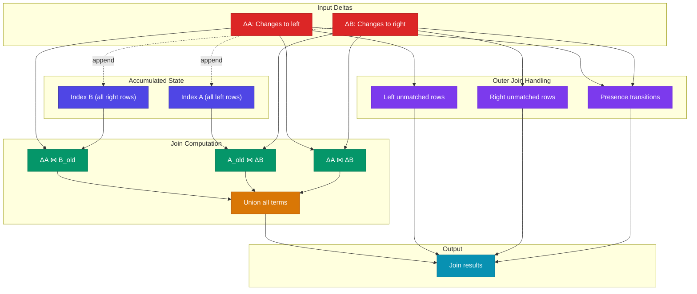
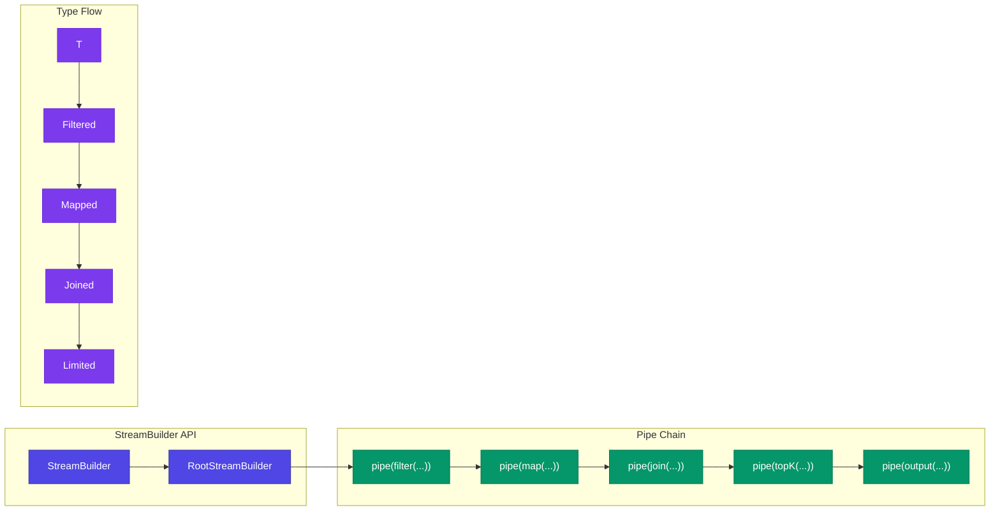

# TanStack DB IVM Architecture

This document details the Incremental View Maintenance (IVM) engine in `@tanstack/db-ivm`, which is a TypeScript implementation of differential dataflow for sub-millisecond reactive query updates.

## Overview

The IVM engine is based on [d2ts](https://github.com/electric-sql/d2ts), a differential dataflow implementation. Instead of re-executing entire queries when data changes, it propagates only the differences (deltas) through a computation graph, achieving O(changes) update complexity rather than O(data).

## Core Concepts

### Differential Dataflow



### MultiSet: The Core Data Structure

A `MultiSet` is a collection of `(value, multiplicity)` pairs that represents differences:

```typescript
// Positive multiplicity = insertion
[{ id: 1, name: "Alice" }, +1]  // Add row

// Negative multiplicity = deletion
[{ id: 1, name: "Alice" }, -1]  // Remove row

// Update = deletion + insertion
[{ id: 1, name: "Alice" }, -1]  // Delete old
[{ id: 1, name: "Bob" },   +1]  // Insert new
```



## Dataflow Graph Architecture



## Operator Classes



## Operators Reference

| Operator | Type | SQL Equivalent | State | Effect-TS Equivalent |
|----------|------|----------------|-------|---------------------|
| `map` | Unary/Linear | SELECT transform | Stateless | `Stream.map` |
| `filter` | Unary/Linear | WHERE | Stateless | `Stream.filter` |
| `negate` | Unary/Linear | - | Stateless | `Stream.map(negate)` |
| `distinct` | Unary | DISTINCT | Stateful | `Stream.changes` |
| `topK` | Unary | LIMIT + OFFSET | Stateful | `Stream.take` |
| `orderBy` | Unary | ORDER BY | Stateful | `Stream.mapAccum` |
| `reduce` | Unary | Aggregations | Stateful | `Stream.runFold` |
| `groupBy` | Unary | GROUP BY | Stateful | `Stream.groupByKey` |
| `consolidate` | Unary | - | Stateful | `Stream.debounce` |
| `join` | Binary | JOIN (all types) | Stateful | `Stream.mergeWith` |
| `concat` | Binary | UNION ALL | Stateless | `Stream.concat` |

## Incremental Update Propagation Sequence



## Join Algorithm

The join operator implements incremental join using delta processing:



### Join Types

| Type | Inner Results | Left Unmatched | Right Unmatched |
|------|---------------|----------------|-----------------|
| `inner` | Yes | No | No |
| `left` | Yes | Yes (with null) | No |
| `right` | Yes | No | Yes (with null) |
| `full` | Yes | Yes (with null) | Yes (with null) |
| `anti` | No | Yes (with null) | No |

## StreamBuilder and Pipe API



### Usage Example

```typescript
import { D2 } from '@tanstack/db-ivm'
import { filter, map, output } from '@tanstack/db-ivm'

// Create dataflow graph
const graph = new D2()

// Create input stream
const input = graph.newInput<{ id: number; value: string }>()

// Build pipeline
input.pipe(
  filter((row) => row.id > 0),
  map((row) => ({ ...row, upper: row.value.toUpperCase() })),
  output((changes) => {
    console.log('Changes:', changes)
  })
)

// Finalize and run
graph.finalize()

// Send data (incremental)
input.sendData([[{ id: 1, value: 'hello' }, 1]])
graph.run()

// Update data
input.sendData([
  [{ id: 1, value: 'hello' }, -1],  // Remove old
  [{ id: 1, value: 'world' }, 1],   // Add new
])
graph.run()
```

## File Structure

```
packages/db-ivm/src/
├── d2.ts              # D2 runtime + StreamBuilder
├── graph.ts           # DifferenceStreamWriter/Reader + Operator base classes
├── multiset.ts        # MultiSet data structure
├── indexes.ts         # Index for join state
├── types.ts           # Type definitions
├── utils.ts           # Utilities
│
├── hashing/
│   ├── index.ts       # Hash exports
│   ├── hash.ts        # Hash function
│   └── murmur.ts      # MurmurHash implementation
│
└── operators/
    ├── index.ts       # All operator exports
    ├── pipe.ts        # Pipe utility
    ├── map.ts         # Map operator
    ├── filter.ts      # Filter operator
    ├── filterBy.ts    # FilterBy operator (index-aware)
    ├── negate.ts      # Negate operator
    ├── concat.ts      # Concat operator
    ├── join.ts        # Join operator (all types)
    ├── reduce.ts      # Reduce operator
    ├── count.ts       # Count aggregation
    ├── distinct.ts    # Distinct operator
    ├── groupBy.ts     # GroupBy operator
    ├── orderBy.ts     # OrderBy operator
    ├── orderByBTree.ts # BTree-optimized ordering
    ├── topK.ts        # TopK (limit/offset)
    ├── topKWithFractionalIndex.ts # TopK with cursor support
    ├── consolidate.ts # Consolidate multiplicities
    ├── keying.ts      # Key extraction utilities
    ├── output.ts      # Output operator
    ├── tap.ts         # Tap (side effects)
    └── debug.ts       # Debug operator
```

## Effect-TS Porting Guide

### D2 Graph → Effect Runtime

```typescript
// Effect-TS equivalent
const DataflowRuntime = Effect.gen(function* () {
  const operators = yield* Ref.make<Array<Operator>>(Array.empty())
  const finalized = yield* Ref.make(false)
  
  const newInput = <T>() => Effect.gen(function* () {
    const queue = yield* Queue.unbounded<MultiSet<T>>()
    return {
      sendData: (data: MultiSet<T>) => Queue.offer(queue, data),
      reader: queue
    }
  })
  
  const step = Effect.gen(function* () {
    const ops = yield* Ref.get(operators)
    yield* Effect.forEach(ops, op => op.run())
  })
  
  const run = Effect.gen(function* () {
    yield* Effect.whileLoop({
      while: pendingWork,
      body: step
    })
  })
  
  return { newInput, step, run }
})
```

### StreamBuilder → Stream Pipeline

```typescript
// Effect-TS stream pipeline
const pipeline = Stream.fromQueue(inputQueue).pipe(
  Stream.filter(predicate),
  Stream.map(transform),
  Stream.groupBy(keyFn),
  Stream.flatMap(processGroup),
  Stream.runForEach(emitChanges)
)
```

### MultiSet → HashMap with Multiplicities

```typescript
// Effect-TS MultiSet
type MultiSet<T> = HashMap<T, number>

const consolidate = <T>(ms: MultiSet<T>): MultiSet<T> =>
  HashMap.filter(ms, (_, mult) => mult !== 0)

const union = <T>(a: MultiSet<T>, b: MultiSet<T>): MultiSet<T> =>
  HashMap.union(a, b, (m1, m2) => m1 + m2)
```

### Join Operator → Stream Merge

```typescript
// Effect-TS incremental join
const incrementalJoin = <K, V1, V2>(
  leftStream: Stream<[K, V1, number]>,
  rightStream: Stream<[K, V2, number]>
) => Effect.gen(function* () {
  const leftIndex = yield* Ref.make(HashMap.empty<K, Array<[V1, number]>>())
  const rightIndex = yield* Ref.make(HashMap.empty<K, Array<[V2, number]>>())
  
  // Process deltas and emit join results...
})
```

## Performance Characteristics

| Operation | Time Complexity | Space Complexity |
|-----------|-----------------|------------------|
| Filter | O(Δ) | O(1) |
| Map | O(Δ) | O(1) |
| Join (inner) | O(Δ × matching keys) | O(N) for indexes |
| GroupBy | O(Δ × log groups) | O(groups) |
| OrderBy | O(Δ × log N) | O(N) for sorted state |
| TopK | O(Δ × log K) | O(K) |
| Consolidate | O(Δ × log Δ) | O(distinct values) |

Where:
- Δ = size of change set (delta)
- N = total accumulated data
- K = limit value

## Related Documentation

- [ARCHITECTURE-OVERVIEW.md](./ARCHITECTURE-OVERVIEW.md) - High-level overview
- [ARCHITECTURE-QUERY.md](./ARCHITECTURE-QUERY.md) - Query compilation to IVM
- [ARCHITECTURE-CORE.md](./ARCHITECTURE-CORE.md) - Collection integration

