# TanStack DB Mutations Architecture

This document details the mutation and transaction system in TanStack DB, including the transaction lifecycle, optimistic updates, and paced mutation strategies.

## Mutation System Overview

TanStack DB uses a transaction-based mutation system that provides:
- **Optimistic updates**: Instant UI feedback before server confirmation
- **Automatic rollback**: Reverts changes if the server rejects them
- **Mutation merging**: Combines multiple mutations within a transaction
- **Paced mutations**: Controlled timing via debounce/throttle/queue strategies

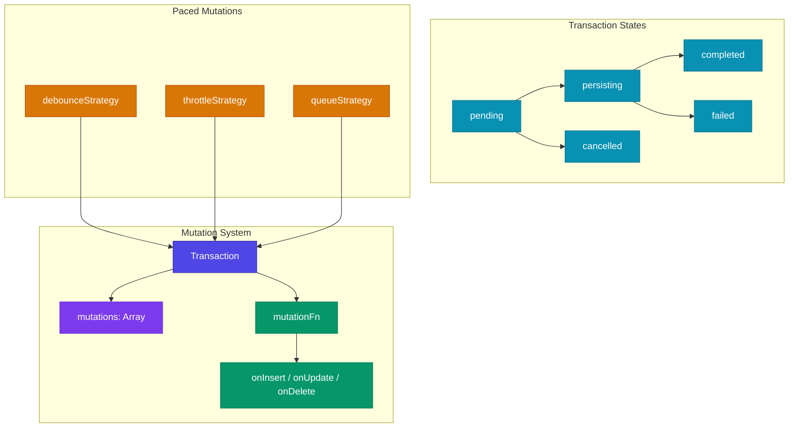

## Transaction Lifecycle

### State Machine

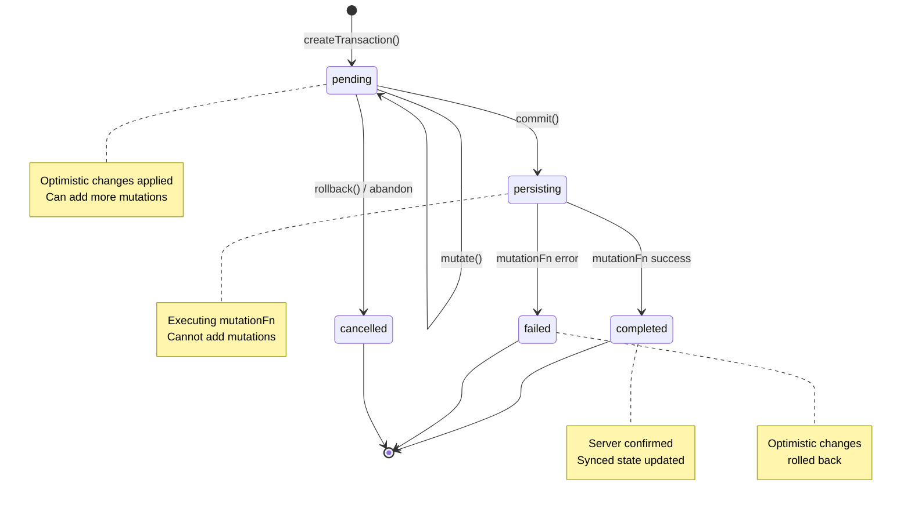

### Transaction Lifecycle Sequence

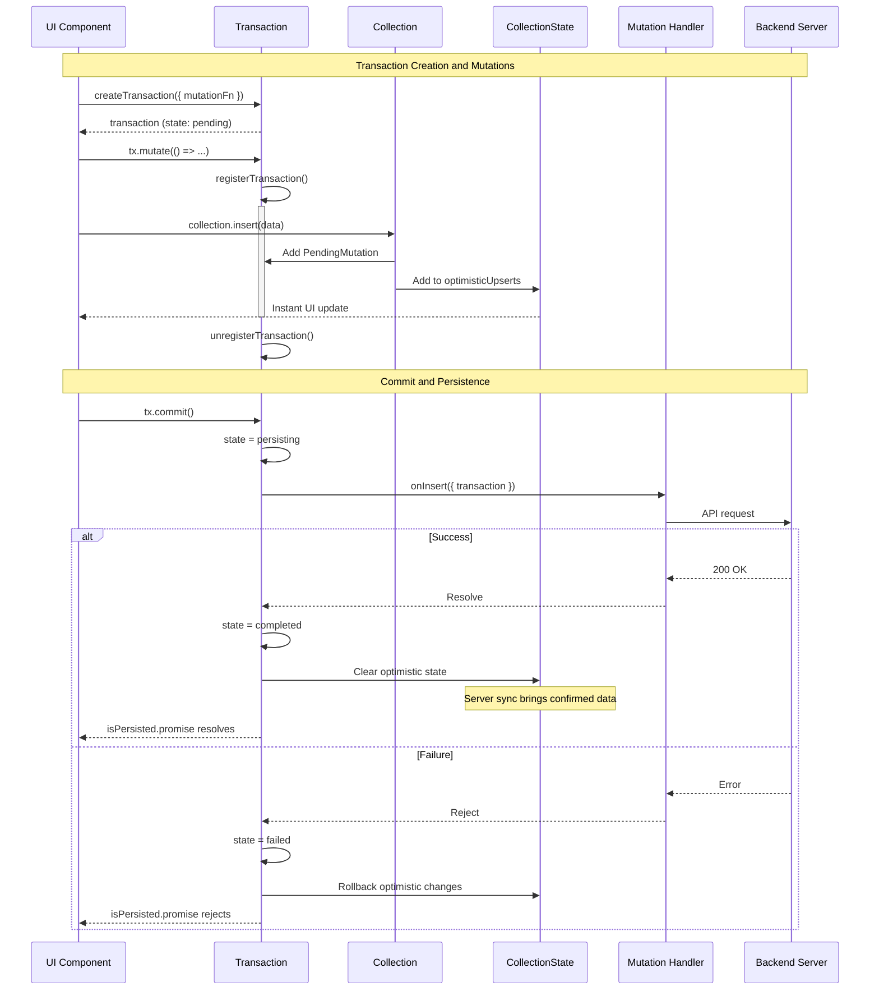

## PendingMutation Structure

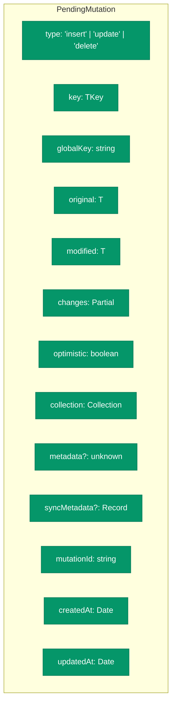

## Mutation Merging

When multiple mutations target the same key within a transaction, they are merged:

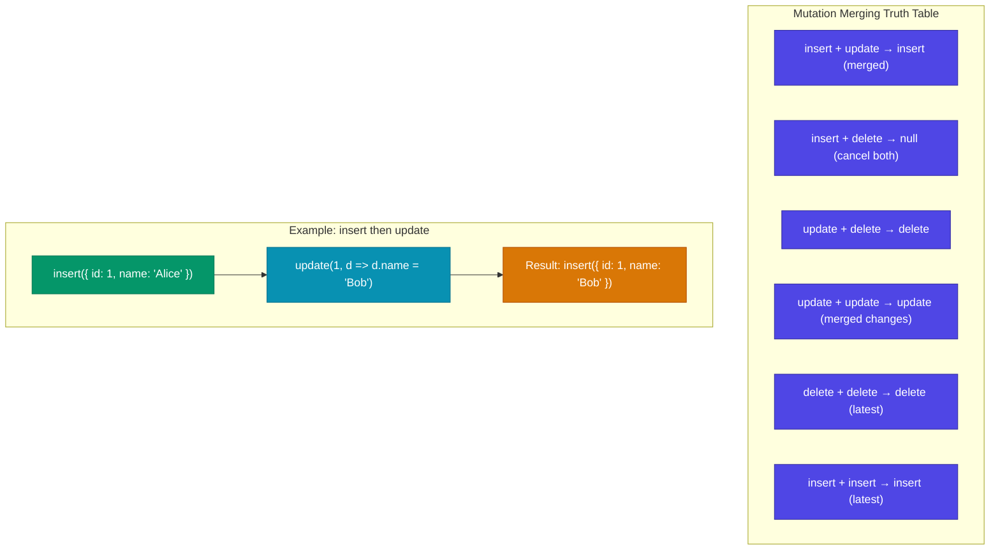

## Paced Mutations

Paced mutations provide controlled timing for mutation persistence:

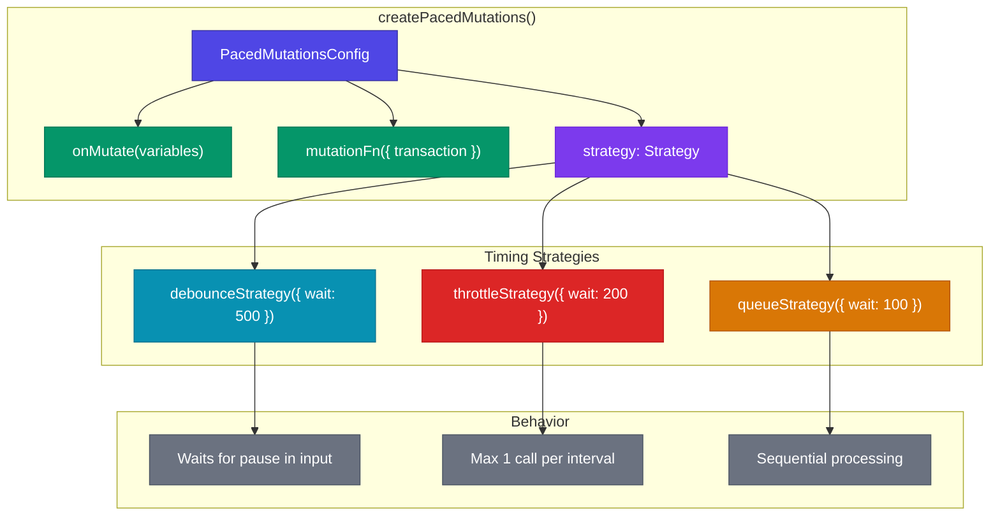

### Debounce Strategy

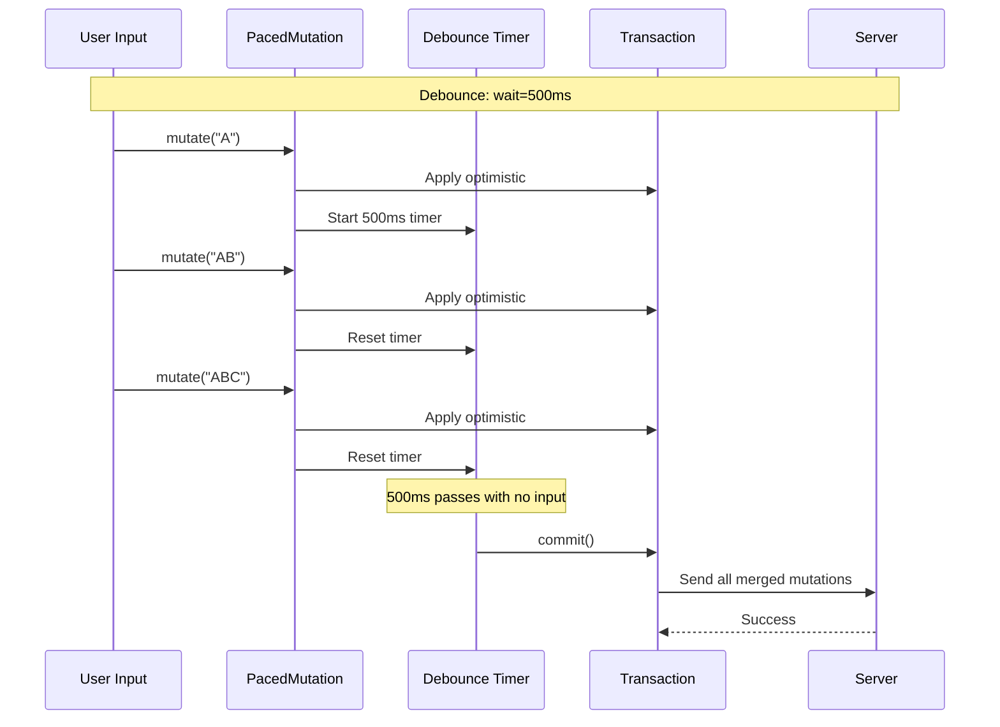

### Throttle Strategy

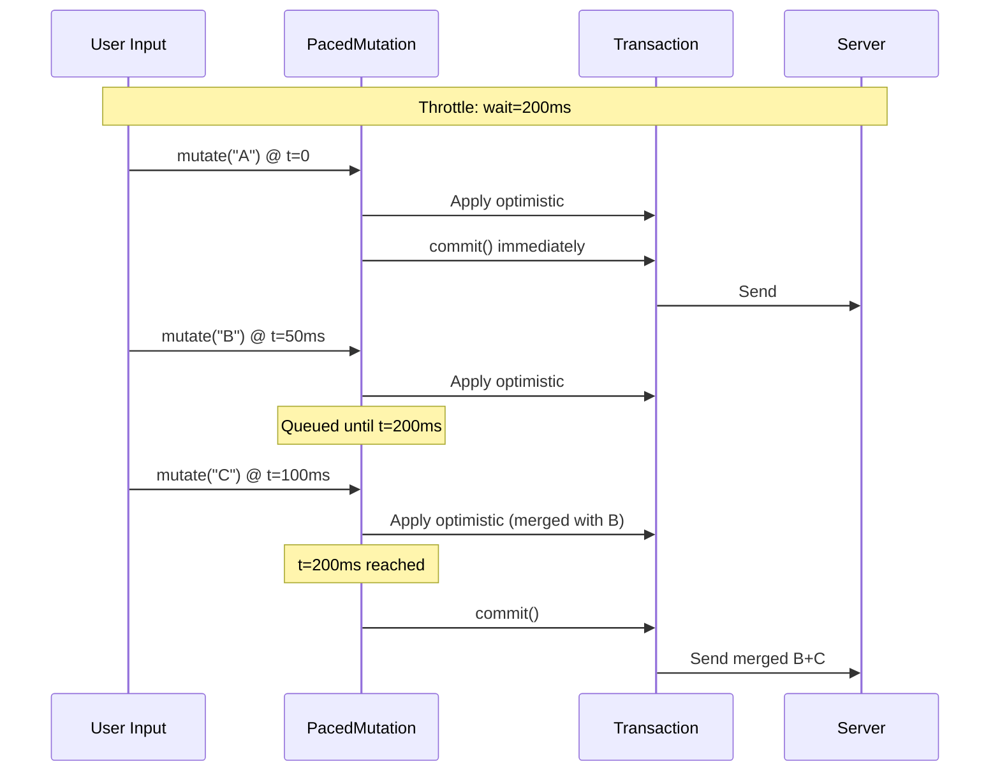

### Queue Strategy

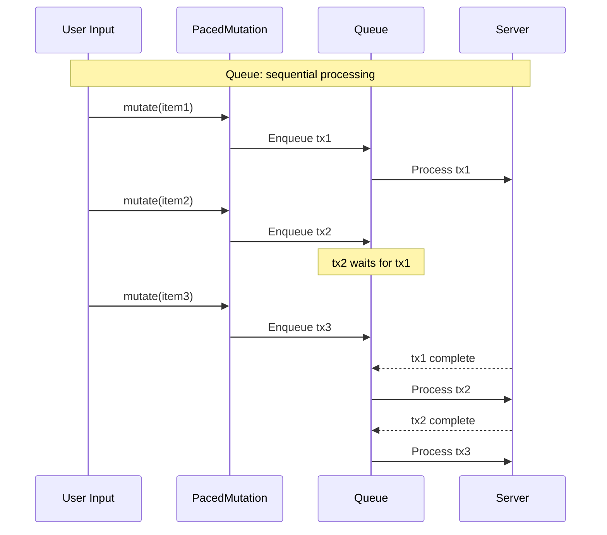

## Optimistic Update Flow

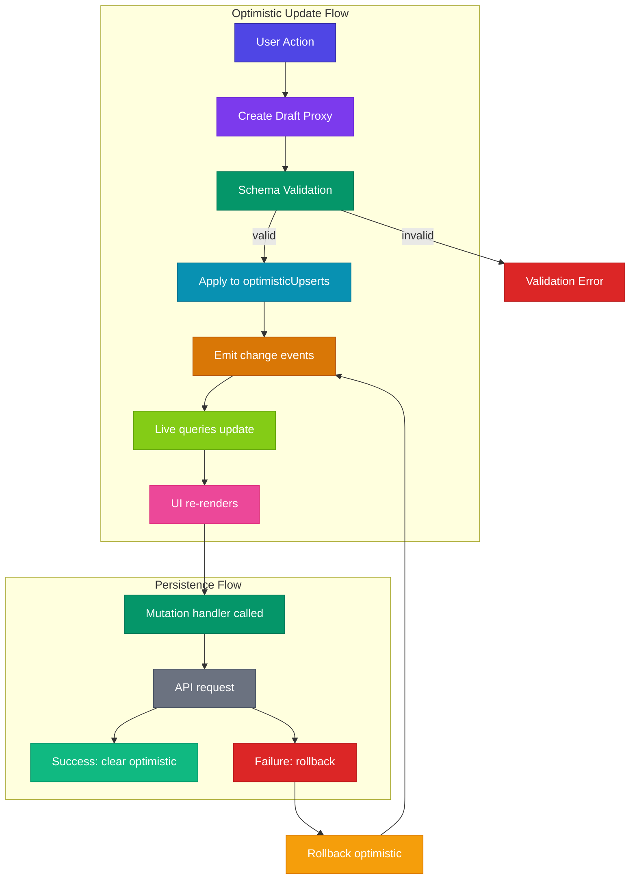

## Ambient Transaction Context

TanStack DB uses an ambient transaction pattern where collection operations automatically join the active transaction:

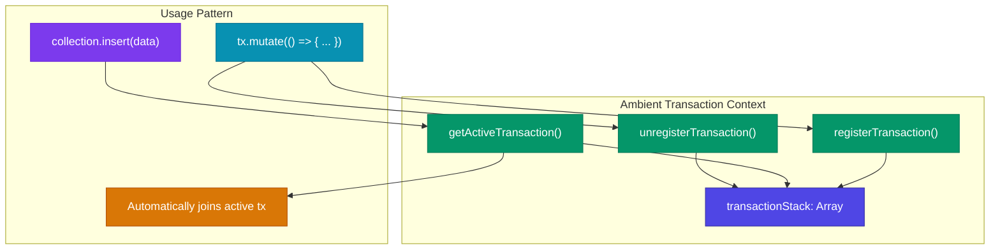

## File Structure

```
packages/db/src/
├── transactions.ts       # Transaction class and createTransaction
├── paced-mutations.ts    # createPacedMutations
├── proxy.ts              # Draft proxy for mutations
├── scheduler.ts          # Transaction-scoped scheduler
├── deferred.ts           # Deferred promise utility
│
├── strategies/
│   ├── index.ts          # Strategy exports
│   ├── types.ts          # Strategy interface
│   ├── debounceStrategy.ts
│   ├── throttleStrategy.ts
│   └── queueStrategy.ts
│
└── collection/
    └── mutations.ts      # CollectionMutationsManager
```

## Effect-TS Porting Guide

### Transaction → Effect.gen with Scope

```typescript
// Effect-TS transaction pattern
interface Transaction<T> {
  readonly id: string
  readonly state: TransactionState
  readonly mutations: Array<PendingMutation<T>>
  readonly commit: Effect.Effect<void, TransactionError>
  readonly rollback: Effect.Effect<void>
}

const createTransaction = <T>(config: TransactionConfig<T>) =>
  Effect.gen(function* () {
    const scope = yield* Effect.scope
    const stateRef = yield* Ref.make<TransactionState>("pending")
    const mutationsRef = yield* Ref.make<Array<PendingMutation<T>>>([])
    const completionDeferred = yield* Deferred.make<void, TransactionError>()
    
    const commit = Effect.gen(function* () {
      yield* Ref.set(stateRef, "persisting")
      const mutations = yield* Ref.get(mutationsRef)
      
      yield* Effect.tryPromise(() => config.mutationFn({ mutations })).pipe(
        Effect.tapError(() => Ref.set(stateRef, "failed")),
        Effect.tap(() => Ref.set(stateRef, "completed")),
        Effect.tap(() => Deferred.succeed(completionDeferred, void 0))
      )
    })
    
    return {
      id: yield* Effect.sync(() => crypto.randomUUID()),
      state: Ref.get(stateRef),
      mutations: Ref.get(mutationsRef),
      commit,
      rollback: Ref.set(stateRef, "cancelled")
    }
  })
```

### Mutation Merging → Pattern Matching

```typescript
// Effect-TS mutation merging with Match
import { Match } from "effect"

const mergeMutations = <T>(
  existing: PendingMutation<T>,
  incoming: PendingMutation<T>
): Option<PendingMutation<T>> =>
  Match.value([existing.type, incoming.type] as const).pipe(
    Match.when(["insert", "update"], () => Option.some({
      ...existing,
      modified: incoming.modified,
      changes: { ...existing.changes, ...incoming.changes }
    })),
    Match.when(["insert", "delete"], () => Option.none()),
    Match.when(["update", "delete"], () => Option.some(incoming)),
    Match.when(["update", "update"], () => Option.some({
      ...incoming,
      original: existing.original,
      changes: { ...existing.changes, ...incoming.changes }
    })),
    Match.orElse(() => Option.some(incoming))
  )
```

### Paced Mutations → Schedule

```typescript
// Effect-TS paced mutations with Schedule
const createPacedMutations = <TVariables, T>(
  config: PacedMutationsConfig<TVariables, T>
) => Effect.gen(function* () {
  const pendingRef = yield* Ref.make<Array<TVariables>>([])
  
  // Debounce schedule
  const debounceSchedule = Schedule.debounce("500 millis")
  
  const flush = Effect.gen(function* () {
    const pending = yield* Ref.getAndSet(pendingRef, [])
    if (pending.length === 0) return
    
    const tx = yield* createTransaction({
      mutationFn: config.mutationFn
    })
    
    for (const variables of pending) {
      yield* tx.mutate(() => config.onMutate(variables))
    }
    
    yield* tx.commit
  })
  
  // Create a stream that flushes on schedule
  const flushFiber = yield* Stream.fromEffect(flush).pipe(
    Stream.schedule(debounceSchedule),
    Stream.runDrain,
    Effect.fork
  )
  
  return (variables: TVariables) => Effect.gen(function* () {
    yield* Ref.update(pendingRef, Array.append(variables))
    // Trigger the debounce...
  })
})
```

### Strategies → Schedule Variants

```typescript
// Effect-TS strategy implementations
const debounceStrategy = (wait: Duration) =>
  Schedule.debounce(wait)

const throttleStrategy = (wait: Duration) =>
  Schedule.spaced(wait)

const queueStrategy = (wait: Duration) =>
  Schedule.fixed(wait).pipe(
    Schedule.ensuring(() => /* release next in queue */)
  )
```

## Related Documentation

- [ARCHITECTURE-OVERVIEW.md](./ARCHITECTURE-OVERVIEW.md) - High-level overview
- [ARCHITECTURE-CORE.md](./ARCHITECTURE-CORE.md) - Collection state management
- [ARCHITECTURE-OFFLINE.md](./ARCHITECTURE-OFFLINE.md) - Offline transaction persistence

