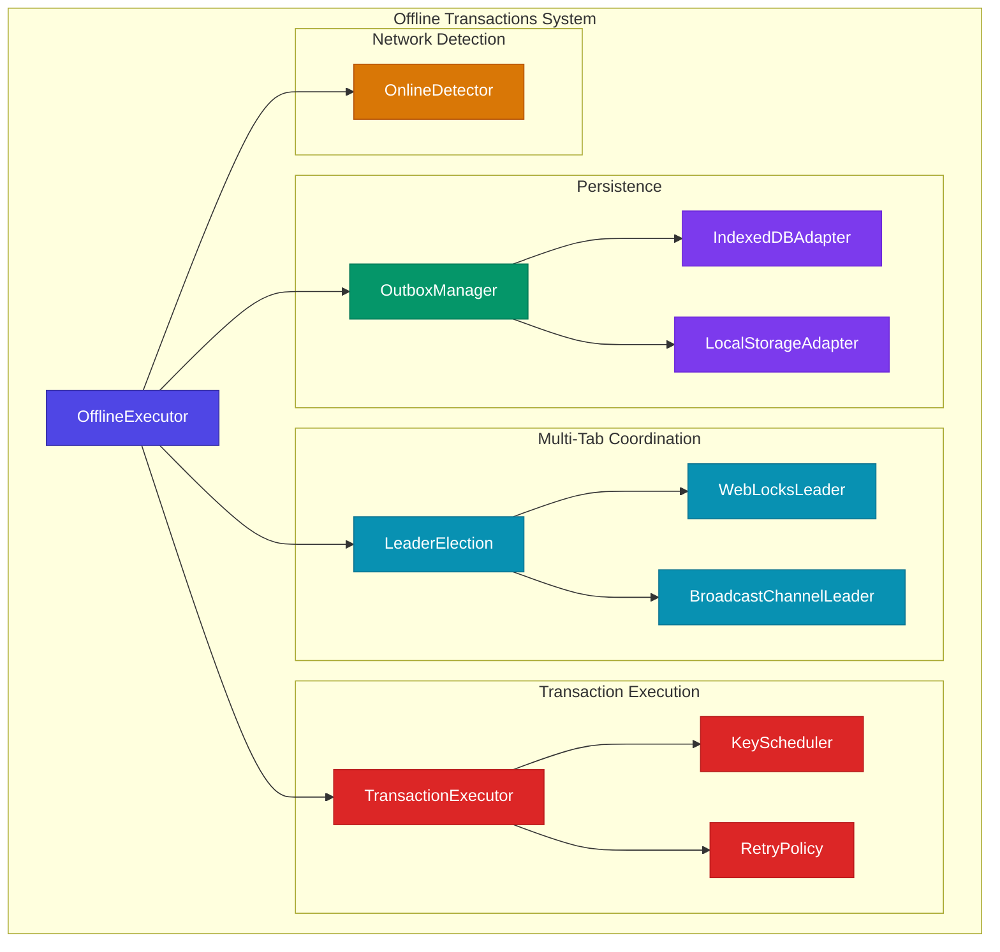
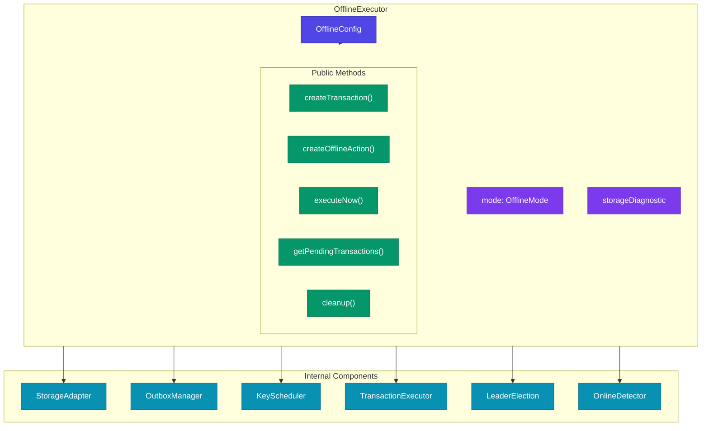
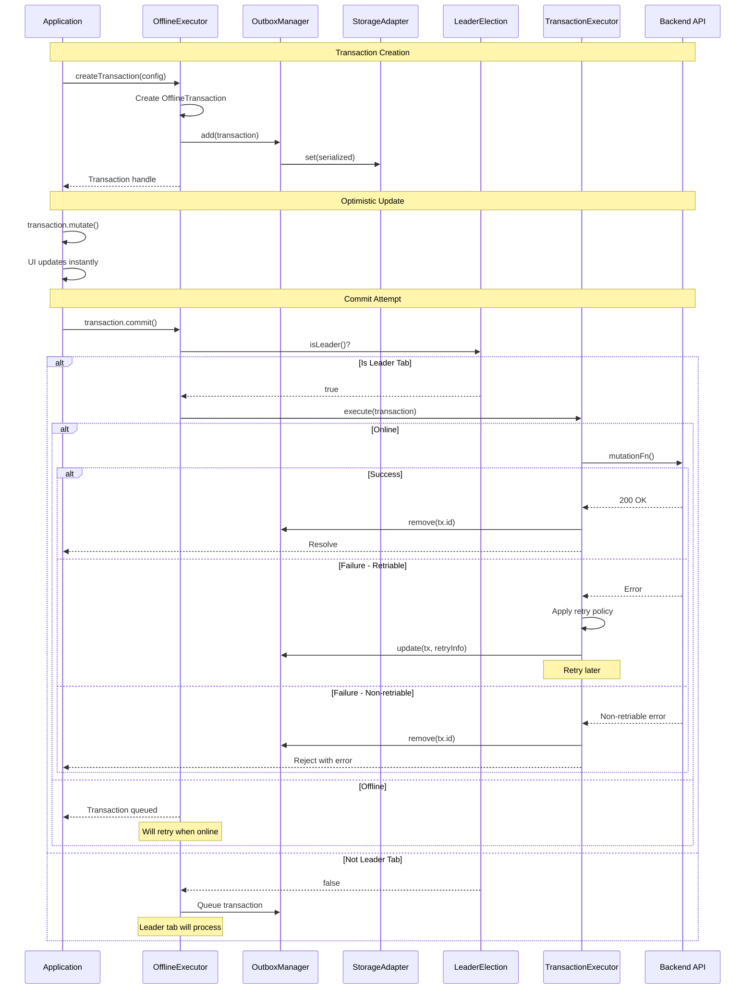
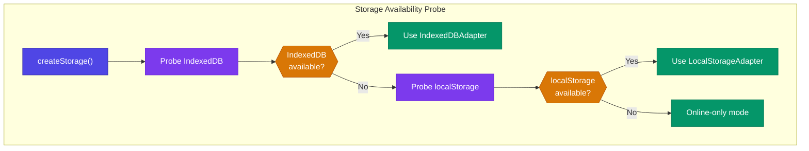
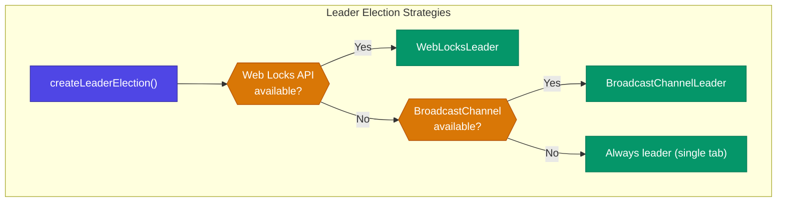
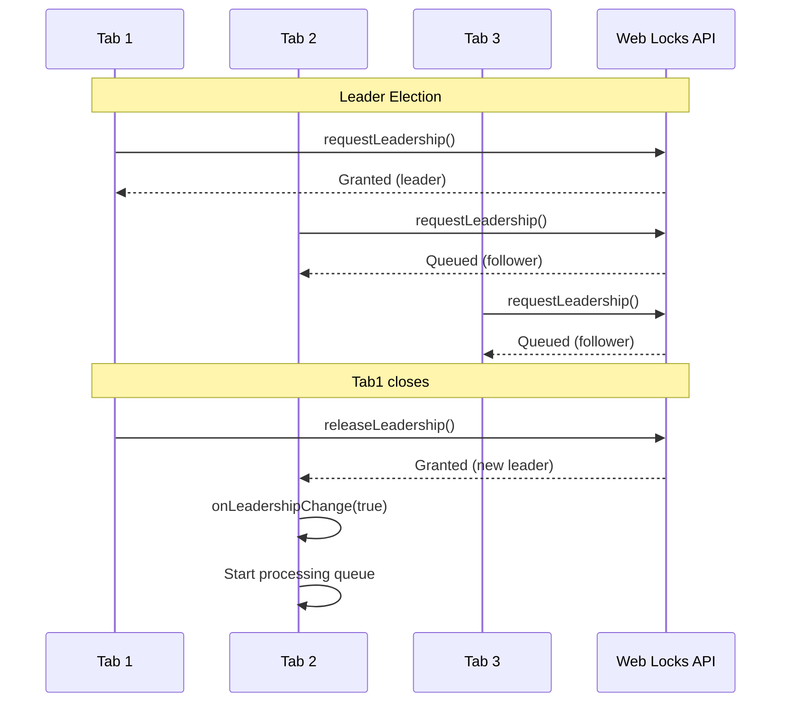
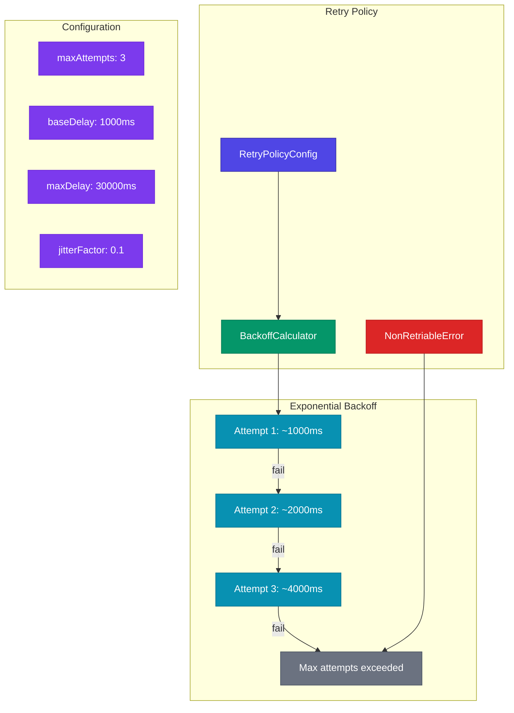
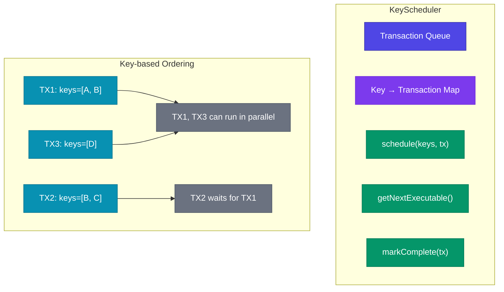
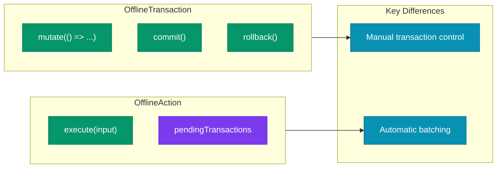
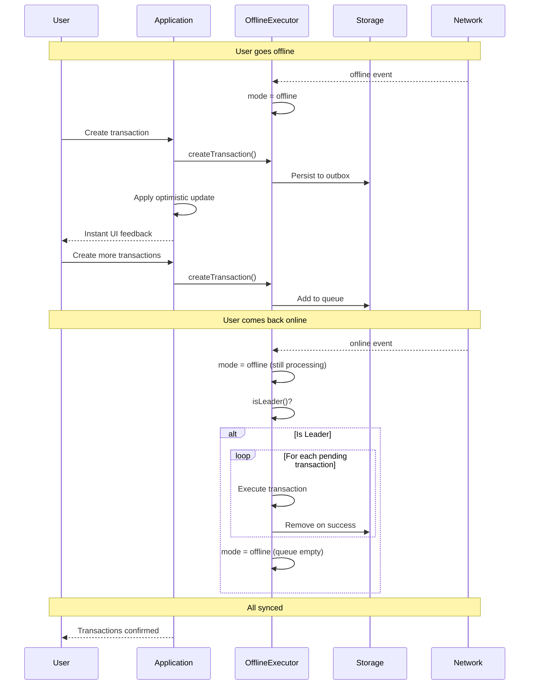

# TanStack DB Offline Transactions Architecture

This document details the offline transactions system in `@tanstack/offline-transactions`, which provides persistent transaction queuing, multi-tab coordination, retry policies, and graceful degradation for offline-first applications.

## System Overview

The offline transactions package enables applications to:
- **Queue transactions** when offline and execute them when online
- **Coordinate across tabs** using leader election to prevent duplicate processing
- **Retry failed transactions** with configurable backoff strategies
- **Persist transactions** to IndexedDB or localStorage with automatic fallback



## OfflineExecutor: Main Coordinator



## Offline Transaction Lifecycle



## Storage System



### Storage Adapter Interface

```typescript
interface StorageAdapter {
  get(key: string): Promise<string | null>
  set(key: string, value: string): Promise<void>
  delete(key: string): Promise<void>
  keys(): Promise<Array<string>>
}
```

### Storage Diagnostics

| Code | Mode | Description |
|------|------|-------------|
| `STORAGE_AVAILABLE` | offline | IndexedDB or localStorage available |
| `INDEXEDDB_UNAVAILABLE` | offline | Using localStorage fallback |
| `STORAGE_BLOCKED` | online-only | Private browsing / security restrictions |
| `QUOTA_EXCEEDED` | online-only | Storage quota exceeded |
| `UNKNOWN_ERROR` | online-only | Unknown storage error |

## Leader Election

Multi-tab coordination ensures only one tab processes offline transactions to prevent duplicates:



### Leader Election Sequence



## Retry Policy



### Backoff Formula

```
delay = min(baseDelay * 2^attempt, maxDelay) * (1 + random * jitterFactor)
```

## Key Scheduler

The KeyScheduler ensures transactions affecting the same keys are processed in order:



## API: OfflineTransaction and OfflineAction



## Full Offline Flow



## File Structure

```
packages/offline-transactions/src/
├── index.ts                    # Public exports
├── OfflineExecutor.ts          # Main coordinator class
├── types.ts                    # Type definitions
│
├── api/
│   ├── OfflineTransaction.ts   # Transaction API
│   └── OfflineAction.ts        # Action API (auto-batching)
│
├── storage/
│   ├── StorageAdapter.ts       # Storage interface
│   ├── IndexedDBAdapter.ts     # IndexedDB implementation
│   └── LocalStorageAdapter.ts  # localStorage fallback
│
├── outbox/
│   ├── OutboxManager.ts        # Transaction queue management
│   └── TransactionSerializer.ts # Serialization/deserialization
│
├── executor/
│   ├── TransactionExecutor.ts  # Transaction execution engine
│   └── KeyScheduler.ts         # Key-based ordering
│
├── coordination/
│   ├── LeaderElection.ts       # Base class
│   ├── WebLocksLeader.ts       # Web Locks implementation
│   └── BroadcastChannelLeader.ts # BroadcastChannel fallback
│
├── connectivity/
│   └── OnlineDetector.ts       # Network status detection
│
├── retry/
│   ├── RetryPolicy.ts          # Retry configuration
│   ├── BackoffCalculator.ts    # Exponential backoff
│   └── NonRetriableError.ts    # Non-retriable error marker
│
└── telemetry/
    └── tracer.ts               # OpenTelemetry integration
```

## Effect-TS Porting Guide

### OfflineExecutor → Effect Layer

```typescript
// Effect-TS offline executor layer
interface OfflineExecutor {
  readonly createTransaction: (config: TransactionConfig) => Effect.Effect<Transaction>
  readonly getPendingTransactions: Effect.Effect<Array<OfflineTransaction>>
  readonly executeNow: Effect.Effect<void>
  readonly cleanup: Effect.Effect<void>
}

const OfflineExecutorLive = Layer.effect(
  OfflineExecutor,
  Effect.gen(function* () {
    const storage = yield* StorageAdapter
    const outbox = yield* OutboxManager
    const leader = yield* LeaderElection
    
    // ... implementation
  })
)
```

### OutboxManager → Queue + KeyValueStore

```typescript
// Effect-TS outbox manager
import { KeyValueStore } from "@effect/platform"

const OutboxManagerLive = Layer.effect(
  OutboxManager,
  Effect.gen(function* () {
    const store = yield* KeyValueStore.KeyValueStore
    
    const add = (tx: OfflineTransaction) => Effect.gen(function* () {
      const key = `tx:${tx.id}`
      const serialized = yield* serialize(tx)
      yield* store.set(key, serialized)
    })
    
    const getAll = Effect.gen(function* () {
      const keys = yield* store.keys
      const txKeys = keys.filter(k => k.startsWith("tx:"))
      return yield* Effect.forEach(txKeys, k => store.get(k).pipe(
        Effect.map(Option.map(deserialize))
      ))
    })
    
    return { add, getAll, /* ... */ }
  })
).pipe(Layer.provide(KeyValueStore.layerIndexedDB))
```

### LeaderElection → Semaphore

```typescript
// Effect-TS leader election
const LeaderElectionLive = Layer.effect(
  LeaderElection,
  Effect.gen(function* () {
    const semaphore = yield* Semaphore.make(1)
    const isLeaderRef = yield* Ref.make(false)
    const listenersRef = yield* Ref.make<Array<(isLeader: boolean) => void>>([])
    
    const requestLeadership = Effect.gen(function* () {
      const permit = yield* Semaphore.withPermits(semaphore, 1)(Effect.succeed(true))
      yield* Ref.set(isLeaderRef, true)
      yield* notifyListeners(true)
      return permit
    })
    
    const releaseLeadership = Effect.gen(function* () {
      yield* Ref.set(isLeaderRef, false)
      yield* notifyListeners(false)
    })
    
    return { requestLeadership, releaseLeadership, isLeader: Ref.get(isLeaderRef) }
  })
)
```

### RetryPolicy → Schedule

```typescript
// Effect-TS retry policy with Schedule
const createRetrySchedule = (config: RetryConfig) =>
  Schedule.exponential(Duration.millis(config.baseDelay), 2).pipe(
    Schedule.jittered,
    Schedule.either(Schedule.recurs(config.maxAttempts)),
    Schedule.whileOutput(([_, n]) => n < config.maxAttempts)
  )

const executeWithRetry = <A, E>(
  effect: Effect.Effect<A, E>,
  policy: RetryConfig
) => effect.pipe(
  Effect.retry(createRetrySchedule(policy)),
  Effect.catchAll(e => 
    isNonRetriable(e) 
      ? Effect.fail(e) 
      : Effect.retry(effect, createRetrySchedule(policy))
  )
)
```

### KeyScheduler → Effect Queue

```typescript
// Effect-TS key scheduler
const KeySchedulerLive = Layer.effect(
  KeyScheduler,
  Effect.gen(function* () {
    const keyLocks = yield* Ref.make<HashMap<string, Deferred<void>>>(HashMap.empty())
    
    const schedule = (keys: Array<string>, tx: Transaction) => Effect.gen(function* () {
      // Acquire locks for all keys
      const locks = yield* Effect.forEach(keys, key => acquireKeyLock(keyLocks, key))
      
      // Execute transaction
      yield* tx.execute
      
      // Release locks
      yield* Effect.forEach(locks, releaseLock)
    })
    
    return { schedule }
  })
)
```

## Related Documentation

- [ARCHITECTURE-OVERVIEW.md](./ARCHITECTURE-OVERVIEW.md) - High-level overview
- [ARCHITECTURE-MUTATIONS.md](./ARCHITECTURE-MUTATIONS.md) - Transaction system
- [ARCHITECTURE-COLLECTIONS.md](./ARCHITECTURE-COLLECTIONS.md) - Collection types

