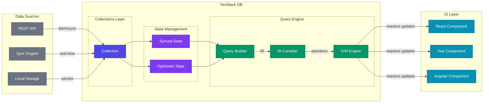
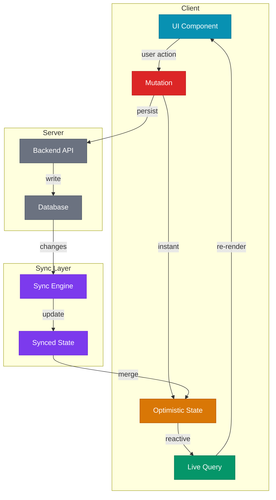

# TanStack DB Architecture Overview

This document provides a high-level overview of the TanStack DB monorepo structure, package relationships, and how the system components fit together.

## System Overview

TanStack DB is a reactive client-side data store that provides:
- **Collections**: Typed sets of objects that can be populated from various data sources
- **Live Queries**: Sub-millisecond reactive queries using incremental view maintenance
- **Optimistic Mutations**: Instant UI updates with automatic sync and rollback

## Package Dependency Graph

```mermaid
flowchart TD
    subgraph External["External Dependencies"]
        TQ["TanStack Query"]:::external
        Electric["ElectricSQL"]:::external
        PowerSync["PowerSync"]:::external
        RxDB["RxDB"]:::external
        TrailBase["TrailBase"]:::external
    end

    subgraph Core["Core Packages"]
        DB["@tanstack/db"]:::core
        IVM["@tanstack/db-ivm"]:::core
    end

    subgraph Adapters["Framework Adapters"]
        ReactDB["@tanstack/react-db"]:::adapter
        VueDB["@tanstack/vue-db"]:::adapter
        AngularDB["@tanstack/angular-db"]:::adapter
        SolidDB["@tanstack/solid-db"]:::adapter
        SvelteDB["@tanstack/svelte-db"]:::adapter
    end

    subgraph Collections["Collection Providers"]
        QueryColl["@tanstack/query-db-collection"]:::collection
        ElectricColl["@tanstack/electric-db-collection"]:::collection
        PowerSyncColl["@tanstack/powersync-db-collection"]:::collection
        RxDBColl["@tanstack/rxdb-db-collection"]:::collection
        TrailBaseColl["@tanstack/trailbase-db-collection"]:::collection
    end

    subgraph Utilities["Utility Packages"]
        Offline["@tanstack/offline-transactions"]:::utility
    end

    %% Core dependencies
    IVM --> DB
    
    %% Framework adapters depend on core
    DB --> ReactDB
    DB --> VueDB
    DB --> AngularDB
    DB --> SolidDB
    DB --> SvelteDB

    %% Collection providers depend on core
    DB --> QueryColl
    DB --> ElectricColl
    DB --> PowerSyncColl
    DB --> RxDBColl
    DB --> TrailBaseColl

    %% External integrations
    TQ --> QueryColl
    Electric --> ElectricColl
    PowerSync --> PowerSyncColl
    RxDB --> RxDBColl
    TrailBase --> TrailBaseColl

    %% Utilities
    DB --> Offline

    %% Click events for navigation
    click DB "https://github.com/TanStack/db/blob/main/packages/db/src/index.ts"
    click IVM "https://github.com/TanStack/db/blob/main/packages/db-ivm/src/index.ts"
    click ReactDB "https://github.com/TanStack/db/blob/main/packages/react-db/src/index.ts"
    click VueDB "https://github.com/TanStack/db/blob/main/packages/vue-db/src/index.ts"
    click AngularDB "https://github.com/TanStack/db/blob/main/packages/angular-db/src/index.ts"
    click SolidDB "https://github.com/TanStack/db/blob/main/packages/solid-db/src/index.ts"
    click SvelteDB "https://github.com/TanStack/db/blob/main/packages/svelte-db/src/index.ts"
    click QueryColl "https://github.com/TanStack/db/blob/main/packages/query-db-collection/src/index.ts"
    click ElectricColl "https://github.com/TanStack/db/blob/main/packages/electric-db-collection/src/index.ts"
    click PowerSyncColl "https://github.com/TanStack/db/blob/main/packages/powersync-db-collection/src/index.ts"
    click RxDBColl "https://github.com/TanStack/db/blob/main/packages/rxdb-db-collection/src/index.ts"
    click TrailBaseColl "https://github.com/TanStack/db/blob/main/packages/trailbase-db-collection/src/index.ts"
    click Offline "https://github.com/TanStack/db/blob/main/packages/offline-transactions/src/index.ts"

    %% Styles
    classDef core fill:#4f46e5,stroke:#3730a3,color:#fff
    classDef adapter fill:#0891b2,stroke:#0e7490,color:#fff
    classDef collection fill:#059669,stroke:#047857,color:#fff
    classDef utility fill:#d97706,stroke:#b45309,color:#fff
    classDef external fill:#6b7280,stroke:#4b5563,color:#fff
```



## Data Flow Architecture



## Unidirectional Data Flow

TanStack DB implements a unidirectional data flow pattern that extends Redux/Flux beyond the client to include the server:



## Package Details

### Core Packages

| Package | Description | Effect-TS Equivalent |
|---------|-------------|---------------------|
| `@tanstack/db` | Core collection and query infrastructure | `Effect.Service` + `Layer` pattern |
| `@tanstack/db-ivm` | Incremental View Maintenance engine (d2ts) | `Stream` pipelines |

### Framework Adapters

| Package | Framework | Key Exports | Effect-TS Equivalent |
|---------|-----------|-------------|---------------------|
| `@tanstack/react-db` | React | `useLiveQuery`, `useLiveSuspenseQuery` | `Effect.runtime` with React integration |
| `@tanstack/vue-db` | Vue 3 | `useLiveQuery` | `Effect.runtime` with Vue reactivity |
| `@tanstack/angular-db` | Angular | `injectLiveQuery` | `Effect.runtime` with Angular DI |
| `@tanstack/solid-db` | Solid.js | `createLiveQuery` | `Effect.runtime` with Solid signals |
| `@tanstack/svelte-db` | Svelte | `liveQuery` store | `Effect.runtime` with Svelte stores |

### Collection Providers

| Package | Data Source | Sync Mode | Effect-TS Equivalent |
|---------|-------------|-----------|---------------------|
| `@tanstack/query-db-collection` | TanStack Query | Fetch-based | `Effect.cached` + `Effect.retry` |
| `@tanstack/electric-db-collection` | ElectricSQL | Real-time sync | `Stream` + `Hub` |
| `@tanstack/powersync-db-collection` | PowerSync | SQLite + sync | `Effect.acquireRelease` |
| `@tanstack/rxdb-db-collection` | RxDB | RxJS streams | `Stream.fromAsyncIterable` |
| `@tanstack/trailbase-db-collection` | TrailBase | REST + subscriptions | `Stream` + `Effect.retry` |

### Utility Packages

| Package | Purpose | Effect-TS Equivalent |
|---------|---------|---------------------|
| `@tanstack/offline-transactions` | Offline persistence, leader election, retry | `Queue` + `Semaphore` + `Schedule` |

## Directory Structure

```
packages/
├── db/                           # Core library
│   └── src/
│       ├── collection/           # Collection implementation
│       ├── query/                # Query builder and compiler
│       ├── indexes/              # Index implementations
│       └── strategies/           # Mutation strategies
│
├── db-ivm/                       # Incremental View Maintenance
│   └── src/
│       ├── operators/            # Dataflow operators
│       └── hashing/              # Hash utilities
│
├── react-db/                     # React adapter
├── vue-db/                       # Vue adapter
├── angular-db/                   # Angular adapter
├── solid-db/                     # Solid adapter
├── svelte-db/                    # Svelte adapter
│
├── query-db-collection/          # TanStack Query integration
├── electric-db-collection/       # ElectricSQL integration
├── powersync-db-collection/      # PowerSync integration
├── rxdb-db-collection/           # RxDB integration
├── trailbase-db-collection/      # TrailBase integration
│
└── offline-transactions/         # Offline support
    └── src/
        ├── api/                  # Public API
        ├── coordination/         # Leader election
        ├── executor/             # Transaction execution
        ├── outbox/               # Persistence queue
        ├── retry/                # Retry policies
        └── storage/              # Storage adapters
```

## Effect-TS Porting Guide

When porting TanStack DB to Effect-TS, the monorepo structure maps to:

| TanStack DB | Effect-TS |
|-------------|-----------|
| Package structure | Workspace with `@effect/*` conventions |
| Module exports | `Effect.Module` pattern with `Layer` |
| Framework adapters | `@effect/platform-*` adapters |
| Collection providers | Custom `Layer` implementations |
| Utilities | `@effect/platform` primitives |

## Related Documentation

- [ARCHITECTURE-CORE.md](./ARCHITECTURE-CORE.md) - Core collection internals
- [ARCHITECTURE-IVM.md](./ARCHITECTURE-IVM.md) - Incremental View Maintenance engine
- [ARCHITECTURE-QUERY.md](./ARCHITECTURE-QUERY.md) - Query builder and compiler
- [ARCHITECTURE-COLLECTIONS.md](./ARCHITECTURE-COLLECTIONS.md) - Collection types
- [ARCHITECTURE-MUTATIONS.md](./ARCHITECTURE-MUTATIONS.md) - Mutation lifecycle
- [ARCHITECTURE-OFFLINE.md](./ARCHITECTURE-OFFLINE.md) - Offline transactions

