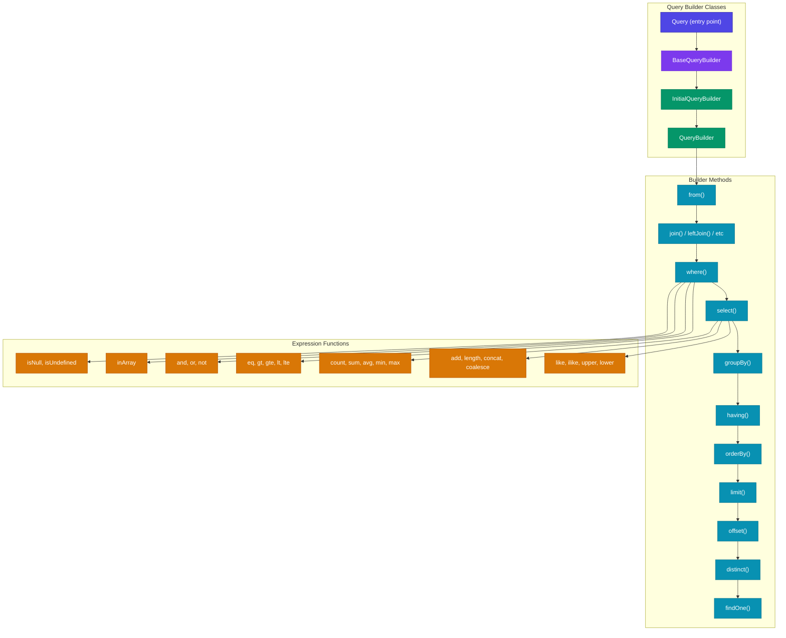
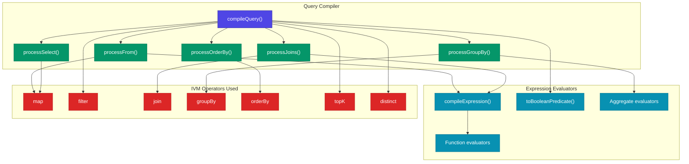
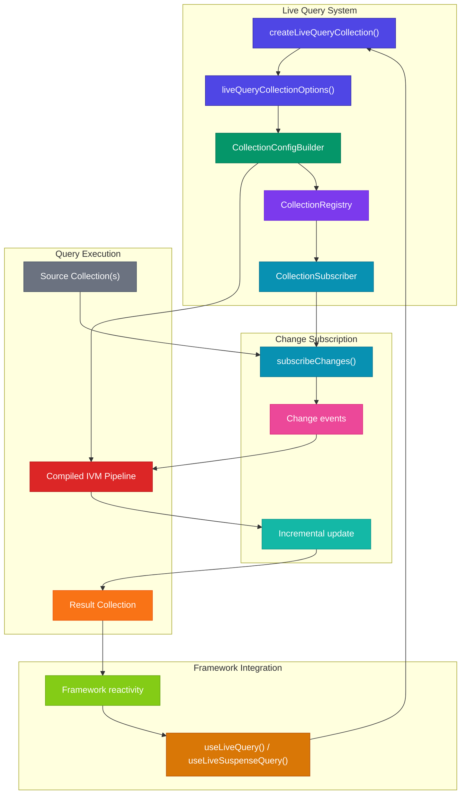
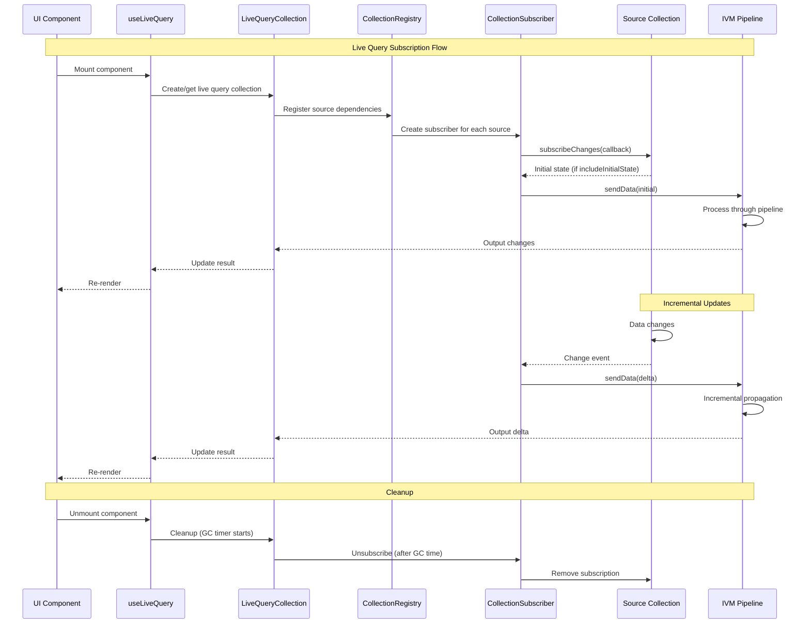
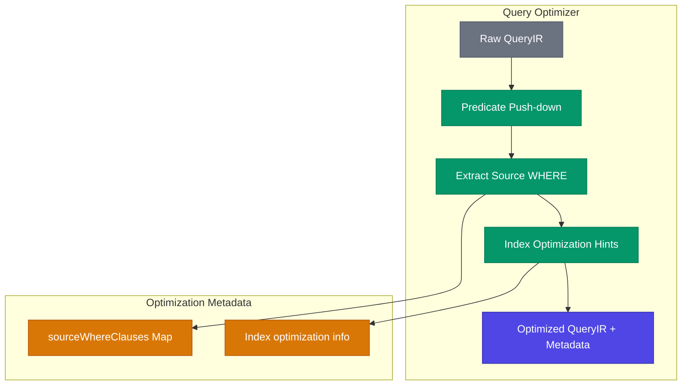

# TanStack DB Query Architecture

This document details the query system in `@tanstack/db`, including the query builder, intermediate representation (IR), compiler, and live query integration.

## Query System Overview

The query system provides a SQL-like fluent API that compiles to an incremental dataflow pipeline:

```mermaid
flowchart LR
    subgraph Input["User Code"]
        QueryAPI["Query Builder API"]:::input
    end

    subgraph Compilation["Compilation Pipeline"]
        IR["Intermediate Representation"]:::ir
        Optimizer["Query Optimizer"]:::optimizer
        Compiler["IR Compiler"]:::compiler
    end

    subgraph Execution["Execution"]
        IVM["IVM Pipeline"]:::ivm
        Output["Live Results"]:::output
    end

    QueryAPI -->|"build"| IR
    IR -->|"optimize"| Optimizer
    Optimizer -->|"compile"| Compiler
    Compiler -->|"operators"| IVM
    IVM -->|"incremental"| Output

    %% Click events
    click QueryAPI "https://github.com/TanStack/db/blob/main/packages/db/src/query/builder/index.ts"
    click IR "https://github.com/TanStack/db/blob/main/packages/db/src/query/ir.ts"
    click Optimizer "https://github.com/TanStack/db/blob/main/packages/db/src/query/optimizer.ts"
    click Compiler "https://github.com/TanStack/db/blob/main/packages/db/src/query/compiler/index.ts"

    %% Styles
    classDef input fill:#4f46e5,stroke:#3730a3,color:#fff
    classDef ir fill:#7c3aed,stroke:#6d28d9,color:#fff
    classDef optimizer fill:#059669,stroke:#047857,color:#fff
    classDef compiler fill:#0891b2,stroke:#0e7490,color:#fff
    classDef ivm fill:#dc2626,stroke:#b91c1c,color:#fff
    classDef output fill:#d97706,stroke:#b45309,color:#fff
```



## Query Builder Architecture



## Intermediate Representation (IR)

The IR captures the structure of a query in a data format that can be optimized and compiled:

```mermaid
flowchart TD
    subgraph QueryIR["QueryIR Structure"]
        Root["QueryIR"]:::root
        
        FromClause["from: From"]:::clause
        SelectClause["select?: Select"]:::clause
        JoinClause["join?: Array<JoinClause>"]:::clause
        WhereClause["where?: Array<Where>"]:::clause
        GroupByClause["groupBy?: GroupBy"]:::clause
        HavingClause["having?: Array<Having>"]:::clause
        OrderByClause["orderBy?: OrderBy"]:::clause
        LimitClause["limit?: number"]:::clause
        OffsetClause["offset?: number"]:::clause
    end

    subgraph FromTypes["From Types"]
        CollectionRef["CollectionRef"]:::ref
        QueryRef["QueryRef (subquery)"]:::ref
    end

    subgraph ExprTypes["Expression Types"]
        PropRef["PropRef (column ref)"]:::expr
        Value["Value (literal)"]:::expr
        Func["Func (function call)"]:::expr
        Aggregate["Aggregate"]:::expr
    end

    Root --> FromClause
    Root --> SelectClause
    Root --> JoinClause
    Root --> WhereClause
    Root --> GroupByClause
    Root --> HavingClause
    Root --> OrderByClause
    Root --> LimitClause
    Root --> OffsetClause

    FromClause --> CollectionRef
    FromClause --> QueryRef

    WhereClause --> PropRef
    WhereClause --> Value
    WhereClause --> Func
    SelectClause --> Aggregate

    %% Click events
    click Root "https://github.com/TanStack/db/blob/main/packages/db/src/query/ir.ts"
    click PropRef "https://github.com/TanStack/db/blob/main/packages/db/src/query/ir.ts"

    %% Styles
    classDef root fill:#4f46e5,stroke:#3730a3,color:#fff
    classDef clause fill:#059669,stroke:#047857,color:#fff
    classDef ref fill:#0891b2,stroke:#0e7490,color:#fff
    classDef expr fill:#d97706,stroke:#b45309,color:#fff
```



### IR Example

```typescript
// Query
q.from({ user: usersCollection })
  .where(({ user }) => eq(user.active, true))
  .select(({ user }) => ({ id: user.id, name: user.name }))

// IR Representation
{
  from: CollectionRef(usersCollection, 'user'),
  where: [
    Func('eq', [PropRef(['user', 'active']), Value(true)])
  ],
  select: {
    id: PropRef(['user', 'id']),
    name: PropRef(['user', 'name'])
  }
}
```

## Query Compilation Pipeline

```mermaid
sequenceDiagram
    participant QB as QueryBuilder
    participant IR as QueryIR
    participant Opt as Optimizer
    participant Comp as Compiler
    participant IVM as D2 Pipeline

    Note over QB,IVM: Query Compilation Flow

    QB->>IR: Build IR from fluent API
    
    IR->>Opt: optimizeQuery(rawIR)
    Opt->>Opt: Push down predicates
    Opt->>Opt: Extract source WHERE clauses
    Opt-->>Comp: optimizedQuery + sourceWhereClauses
    
    Comp->>Comp: processFrom(from)
    Comp->>Comp: processJoins(joins)
    Comp->>Comp: Apply WHERE filters
    Comp->>Comp: processGroupBy(groupBy)
    Comp->>Comp: Apply HAVING filters
    Comp->>Comp: processSelect(select)
    Comp->>Comp: processOrderBy(orderBy)
    Comp->>Comp: Apply limit/offset
    Comp->>Comp: Apply distinct
    
    Comp->>IVM: Return compiled pipeline
```

## Compiler Modules



## Live Query Architecture



## Live Query Subscription Lifecycle



## Query Optimizer

The optimizer performs several transformations on the IR before compilation:



## File Structure

```
packages/db/src/query/
├── index.ts                    # Public exports
├── ir.ts                       # Intermediate Representation types
├── optimizer.ts                # Query optimization
├── predicate-utils.ts          # Predicate subset/union utilities
├── subset-dedupe.ts            # Deduplication for load subset
├── expression-helpers.ts       # Expression building helpers
├── live-query-collection.ts    # Live query collection factory
│
├── builder/
│   ├── index.ts                # QueryBuilder classes
│   ├── types.ts                # Builder type definitions
│   ├── functions.ts            # Expression functions (eq, gt, etc.)
│   └── ref-proxy.ts            # Ref proxy for column references
│
├── compiler/
│   ├── index.ts                # Main compileQuery function
│   ├── types.ts                # Compiler types
│   ├── evaluators.ts           # Expression evaluation
│   ├── expressions.ts          # Expression compilation
│   ├── joins.ts                # JOIN processing
│   ├── group-by.ts             # GROUP BY processing
│   ├── select.ts               # SELECT processing
│   └── order-by.ts             # ORDER BY processing
│
└── live/
    ├── types.ts                # Live query types
    ├── internal.ts             # Internal symbols
    ├── collection-config-builder.ts  # Config builder
    ├── collection-registry.ts        # Dependency registry
    └── collection-subscriber.ts      # Source subscription
```

## Effect-TS Porting Guide

### QueryBuilder → Branded Types + pipe

```typescript
// Effect-TS query builder pattern
interface QueryBuilder<From, Select, Where> {
  readonly _tag: "QueryBuilder"
  readonly _from: From
  readonly _select: Select
  readonly _where: Where
}

const from = <T>(source: Source<T>): QueryBuilder<T, unknown, never> => ({
  _tag: "QueryBuilder",
  _from: source,
  _select: undefined,
  _where: undefined as never
})

const where = <From, Select, Where, NewWhere>(
  predicate: (row: From) => NewWhere
) => (
  builder: QueryBuilder<From, Select, Where>
): QueryBuilder<From, Select, Where | NewWhere> => ({
  ...builder,
  _where: predicate(builder._from as any)
})

// Usage with pipe
const query = pipe(
  from(usersCollection),
  where(({ user }) => eq(user.active, true)),
  select(({ user }) => ({ id: user.id }))
)
```

### IR → Effect Schema Types

```typescript
// Effect-TS IR with Schema
import * as S from "@effect/schema/Schema"

const PropRef = S.Struct({
  type: S.Literal("ref"),
  path: S.Array(S.String)
})

const Value = S.Struct({
  type: S.Literal("val"),
  value: S.Unknown
})

const Func = S.Struct({
  type: S.Literal("func"),
  name: S.String,
  args: S.Array(S.Union(PropRef, Value, S.suspend(() => Func)))
})

const QueryIR = S.Struct({
  from: S.Union(CollectionRef, QueryRef),
  where: S.optional(S.Array(Func)),
  select: S.optional(S.Record(S.String, S.Union(PropRef, Value, Func))),
  // ...
})
```

### Compiler → Effect.gen Pipeline

```typescript
// Effect-TS compiler
const compileQuery = (ir: QueryIR) => Effect.gen(function* () {
  const optimized = yield* optimizeQuery(ir)
  
  const fromStream = yield* processFrom(optimized.from)
  
  let pipeline = fromStream
  
  if (optimized.join) {
    pipeline = yield* processJoins(pipeline, optimized.join)
  }
  
  if (optimized.where) {
    pipeline = yield* applyWhere(pipeline, optimized.where)
  }
  
  if (optimized.select) {
    pipeline = yield* processSelect(pipeline, optimized.select)
  }
  
  return pipeline
})
```

### LiveQueryCollection → SubscriptionRef + Stream

```typescript
// Effect-TS live query
const createLiveQuery = <T>(query: QueryIR) => Effect.gen(function* () {
  const resultRef = yield* SubscriptionRef.make<Array<T>>(Array.empty())
  
  const compiledPipeline = yield* compileQuery(query)
  
  // Subscribe to source changes
  const subscription = yield* Stream.fromSubscriptionRef(sourceChanges).pipe(
    Stream.mapEffect(changes => updatePipeline(compiledPipeline, changes)),
    Stream.runForEach(results => SubscriptionRef.set(resultRef, results))
  )
  
  return {
    results: SubscriptionRef.get(resultRef),
    changes: SubscriptionRef.changes(resultRef),
    cleanup: Fiber.interrupt(subscription)
  }
})
```

## Related Documentation

- [ARCHITECTURE-OVERVIEW.md](./ARCHITECTURE-OVERVIEW.md) - High-level overview
- [ARCHITECTURE-CORE.md](./ARCHITECTURE-CORE.md) - Collection architecture
- [ARCHITECTURE-IVM.md](./ARCHITECTURE-IVM.md) - IVM engine details

